# New API 项目数据库结构文档

本文档梳理了项目的完整数据库表结构及其关联关系，并提供了可视化的 ER 图。

## 1. 可视化关系图 (ER Diagram)

```mermaid
erDiagram
    %% 用户体系
    User ||--o{ Token : "拥有 (Has)"
    User ||--o{ Log : "产生 (Generates)"
    User ||--o{ TopUp : "充值 (Recharges)"
    User ||--o{ Redemption : "兑换 (Redeems)"
    User ||--o{ User : "邀请 (Invites)"
    User ||--o{ PasskeyCredential : "绑定 (Binds)"
    User ||--o| TwoFA : "配置 (Configures)"
    User ||--o{ TwoFABackupCode : "备用码 (Has)"

    %% 任务体系
    User ||--o{ Midjourney : "提交 (Submits)"
    User ||--o{ Task : "提交 (Submits)"
    Channel ||--o{ Midjourney : "处理 (Processes)"
    Channel ||--o{ Task : "处理 (Processes)"

    %% 渠道与路由体系
    Channel ||--o{ Ability : "提供 (Provides)"
    Channel ||--o{ Log : "处理 (Processes)"
    Vendor ||--o{ Model : "供应 (Supplies)"

    %% 统计与配置
    User ||--o{ QuotaData : "统计 (Stats)"
    
    %% 核心表定义
    User {
        int id PK
        string username "用户名"
        string password "加密密码"
        int role "角色"
        int status "状态"
        int quota "当前余额"
        string group "用户分组"
        string aff_code "邀请码"
    }

    Channel {
        int id PK
        string name "渠道名称"
        int type "类型"
        string key "API Key"
        string models "支持模型"
        string group "服务分组"
        int priority "优先级"
        int weight "权重"
    }

    Ability {
        string group PK "分组"
        string model PK "模型"
        int channel_id PK "渠道ID"
        boolean enabled "启用状态"
        int priority "优先级"
        int weight "权重"
    }

    Token {
        int id PK
        int user_id FK
        string key "sk-令牌"
        int remain_quota "剩余额度"
        string model_limits "模型限制"
    }

    Log {
        int id PK
        int type "类型"
        int user_id FK
        int channel_id FK
        string model_name "模型"
        int quota "变动额度"
        int use_time "耗时"
    }

    Midjourney {
        int id PK
        int user_id FK
        int channel_id FK
        string mj_id "MJ任务ID"
        string action "操作类型"
        string status "状态"
        string prompt "提示词"
        string image_url "图片链接"
    }

    Task {
        int id PK
        string task_id "任务ID"
        string platform "平台(Suno/Sora)"
        string action "操作"
        string status "状态"
    }

    Model {
        int id PK
        string model_name "模型名称"
        int vendor_id FK "供应商ID"
        string tags "标签"
        string description "描述"
    }

    Vendor {
        int id PK
        string name "供应商名称"
        string icon "图标"
    }

    PasskeyCredential {
        int id PK
        int user_id FK
        string credential_id "凭证ID"
        string public_key "公钥"
    }

    TwoFA {
        int id PK
        int user_id FK
        string secret "TOTP密钥"
        bool is_enabled "是否启用"
    }

    QuotaData {
        int id PK
        int user_id FK
        string model_name "模型"
        int count "调用次数"
        int quota "消耗额度"
        int token_used "Token消耗"
    }

    PrefillGroup {
        int id PK
        string name "组名"
        string type "类型(model/tag)"
        json items "列表项"
    }
```

## 2. 详细表结构说明

### 2.1 用户与认证 (User & Auth)
- **User (用户表)**: 核心主体，包含余额 (`quota`)、分组 (`group`)、邀请关系 (`inviter_id`) 等。
- **Token (令牌表)**: API 访问凭证，支持额度和模型限制。
- **PasskeyCredential**: WebAuthn/Passkey 无密码登录凭证。
- **TwoFA & TwoFABackupCode**: 双因素认证设置及备用码，增强账户安全。

### 2.2 渠道与路由 (Channel & Routing)
- **Channel (渠道表)**: 上游服务商配置，支持多 Key 轮询。
- **Ability (能力表)**: **路由加速核心**。将 `Channel` 的模型配置拆解为 `(Group, Model) -> Channel` 的映射，实现 O(1) 复杂度的路由查询。
- **Model (模型元数据)**: 存储模型的展示信息（图标、描述、标签），用于前端展示。
- **Vendor (供应商)**: 模型的供应商信息（如 OpenAI, Anthropic），用于模型分类展示。
- **PrefillGroup**: 预定义的模型组或标签组，用于简化配置。

### 2.3 异步任务 (Async Tasks)
- **Midjourney**: 专门存储 Midjourney 绘画任务，包含 `mj_id`、`prompt`、`image_url` 等专用字段。
- **Task**: 通用异步任务表，用于支持 Suno (音乐)、Sora (视频) 等生成式任务，结构更通用。

### 2.4 财务与统计 (Finance & Stats)
- **Log (日志表)**: 全局流水，记录所有充值和消费。
- **QuotaData (数据看板)**: 聚合统计表。
  - 为了提高看板查询性能，系统会定期将 `Log` 表的数据聚合到此表。
  - 维度包括：`user_id`, `model_name`, `created_at` (按小时聚合)。
- **TopUp (在线充值)**: 记录 Stripe、易支付等在线支付订单。
- **Redemption (兑换码)**: 卡密充值记录。

### 2.5 系统配置 (System)
- **Option**: 全局 Key-Value 配置表。
- **Setup**: 记录系统初始化时间和版本信息。
