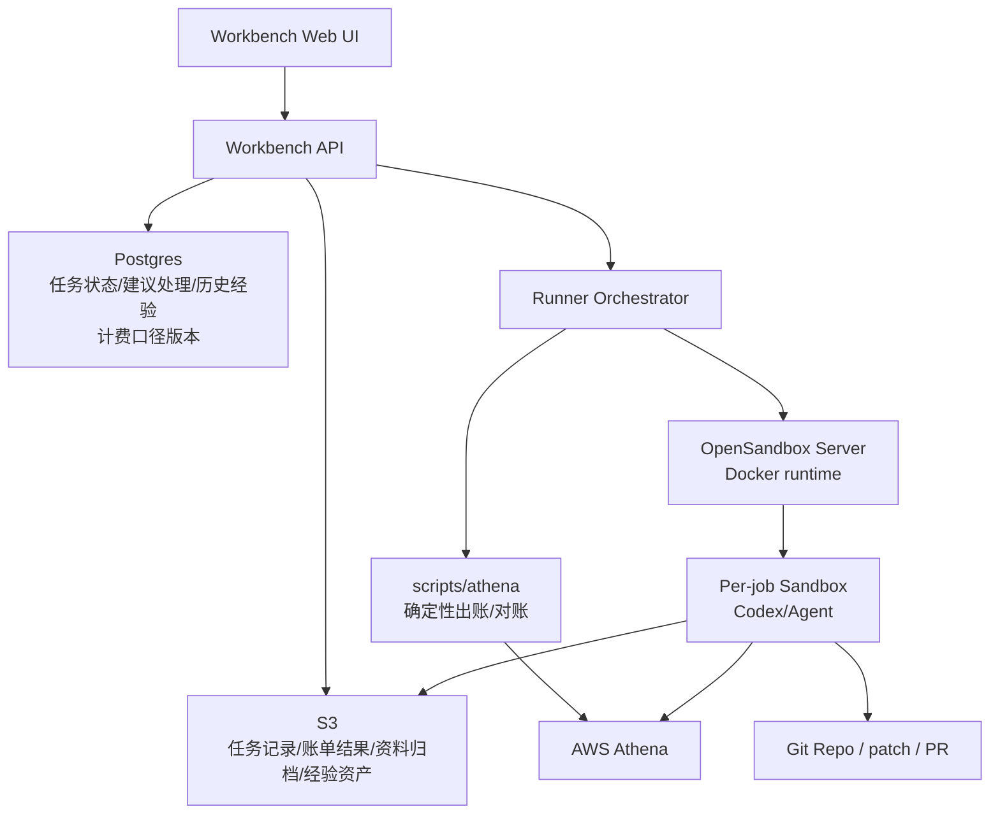

# Agent 沙箱工作台总体架构

## 1. 设计原则

当前项目已有成熟的账单生成与对账能力，因此工作台不重写账务逻辑，而是把现有系统包装为可调度、可追溯、可复跑的任务。

原则：

- **正式账单只使用现有账单生成系统**。
- **Agent 是实时对话助手，默认带上本次账单、供应商资料和计费口径**。
- **Agent 可以提出调整建议、解释差异、生成报告和经验草稿**。
- **建议由用户选择应用、忽略、重新生成账单或保存为经验，不设计阻塞式审批流程**。
- **所有输入、处理记录、结果文件和经验沉淀都归档，便于追溯**。

## 2. 架构图



## 3. 第一阶段部署

推荐先使用单台 EC2 + Docker Compose。

```text
agent-workbench-host
  /srv/agent-workbench/
    jobs/
    cache/
    logs/
    config/

  containers:
    workbench-web
    workbench-api
    runner-orchestrator
    opensandbox-server
    postgres or sqlite
    redis optional
```

OpenSandbox Docker runtime 负责创建每个 job 的 sandbox container。

注意：

- OpenSandbox Server 会访问 Docker socket，因此它只能放在内网。
- Codex sandbox 不能访问 Docker socket。
- Workbench API 是唯一可以调用 Runner/OpenSandbox 的入口。

## 4. 第二阶段部署

当单机资源不够时，迁到 ECS on EC2：

```text
ECS Cluster on EC2
  service/workbench-web
  service/workbench-api
  service/runner-orchestrator
  service/opensandbox-server
  EC2 host Docker runtime
```

## 5. 第三阶段部署

当需要高并发、多租户、强隔离、预热池时，迁到 EKS：

```text
EKS
  opensandbox-controller
  BatchSandbox CRD
  sandbox node group
  gVisor/Kata/Firecracker RuntimeClass
```

OpenSandbox 已支持 Docker runtime 和 Kubernetes runtime，因此迁移时 Workbench 的上层 job 模型可以保持不变，只替换 Runner 的 runtime adapter。

## 6. OpenSandbox 适配要点

从 `opensandbox-group/OpenSandbox` 代码看，当前可用能力包括：

- Docker runtime。
- Kubernetes runtime。
- Lifecycle API：创建、查询、删除、pause/resume sandbox。
- Execd API：命令执行、文件读写、code interpreter。
- Credential Vault：凭证代理，不把真实 key 暴露给 sandbox。
- Egress policy：限制 sandbox 出网。
- Secure runtime：Docker 可接 gVisor/Kata，Kubernetes 可接 gVisor/Kata/Firecracker。

本工作台第一阶段采用：

```toml
[runtime]
type = "docker"

[docker]
network_mode = "bridge"
no_new_privileges = true
pids_limit = 4096

[ingress]
mode = "direct"
```

生产建议：

- 设置 `server.api_key`。
- 限制 `storage.allowed_host_paths`。
- 默认 deny egress。
- 使用 Credential Vault 注入 OpenAI/AWS/GitHub 凭证。
- 后续安装 gVisor，并启用 `secure_runtime.type = "gvisor"`。

## 7. 与账务系统的边界

正式账务链路：

```text
Workbench API
  -> billing_run job
  -> scripts/athena/bill_cli.py
  -> output to S3
  -> billing_runs record
```

Agent 对话链路：

```text
Workbench API
  -> agent conversation
  -> OpenSandbox sandbox
  -> read billing output + supplier bill + historical sessions
  -> real-time conversation
  -> suggestions / report / skill draft
  -> apply suggestion or save experience
  -> optional billing rerun
```

Codex 允许：

- 读 Athena 结果。
- 读供应商账单。
- 写 SQL 草稿。
- 修改折扣/映射/解析器草稿。
- 跑 dry-run。
- 写报告。
- 生成 Skill。

Codex 禁止：

- 写生产账务表。
- 直接发布正式账单。
- 直接修改线上折扣。
- 直接调用 Docker。

## 8. Pricing/Discounts 配置管理

Workbench DB 需要成为 pricing、discounts、model mapping、vendor mapping 的生产事实源。

现有文件：

```text
scripts/athena/pricing.json
scripts/athena/discounts.json
```

在平台化后只作为：

- 本地开发默认值。
- 初始化 seed。
- 灾备 fallback。
- Athena Worker 的运行时兼容快照。

正式链路：

```text
pricing/discount rules in DB
  -> billing_config_version
  -> export pricing.json / discounts.json
  -> formal billing_run
  -> archive config snapshot to S3
```

Agent 发现计费口径可能需要调整时，不直接改生产 JSON，而是输出建议：

```text
config_suggestion.json
impact_summary.json
report.md
```

用户选择应用建议后由 Workbench 写入 DB，生成新的 `billing_config_version`，再触发正式重跑。

## 9. 本地 Docker E2E 优先

所有平台能力在上云前，必须先能用本地 Docker 完成端到端验证。

本地 E2E 使用：

```text
Postgres       -> Workbench DB
MinIO          -> S3 替身
OpenSandbox    -> Docker runtime
mock Athena     -> fixture usage/rawlogs
fake agent      -> 稳定输出 report/config_change_request/skill_draft
```

验证闭环：

```text
DB config
  -> export pricing/discounts JSON
  -> fixture billing_run
  -> supplier_reconcile
  -> OpenSandbox sandbox
  -> Agent output
  -> apply suggestion
  -> new config_version
  -> billing rerun
  -> Skill publish
```

真实 Athena、真实 Codex、真实 S3 只在 staging/manual E2E 中启用。
> Billing Automation v2 target architecture: [账单自动化最终综合方案](billing-automation-final-plan.md)
> Production AWS deployment: [AWS 部署文档](aws-deployment.md)
