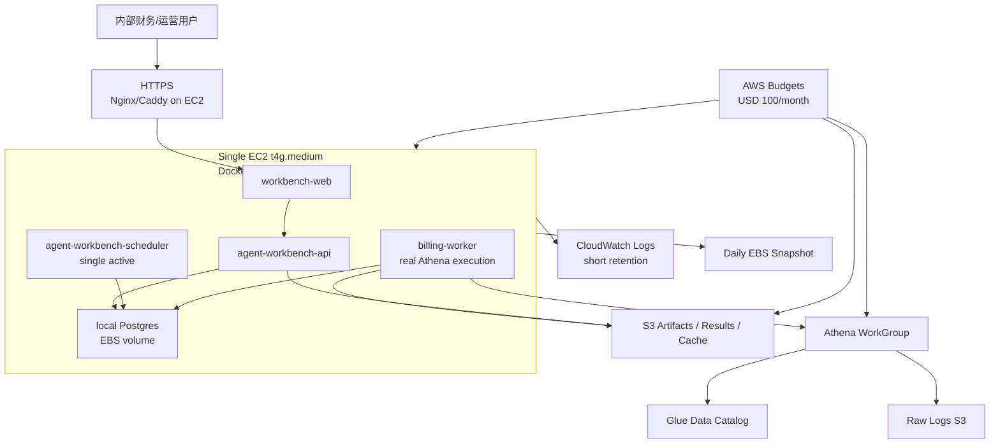
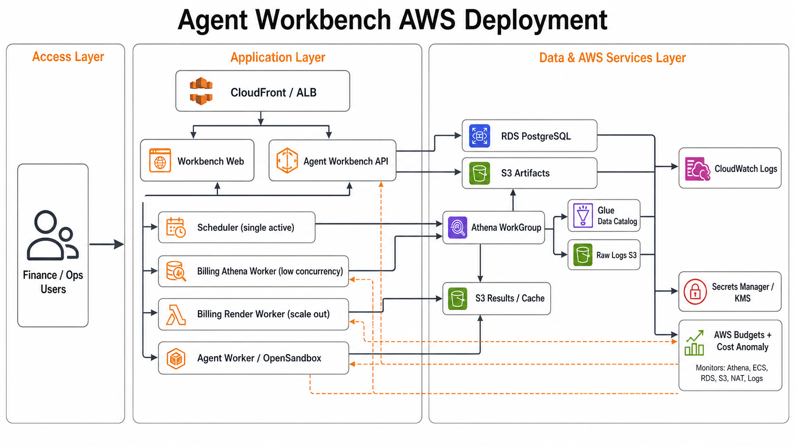
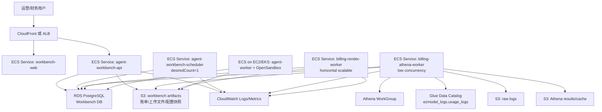

# Agent Workbench AWS 部署文档

## 1. 部署目标

本文档描述 Agent Workbench 在 AWS 上的生产部署方案，重点覆盖账单自动化链路：

```text
Workbench Web/API
  -> Scheduler 创建日结/月结任务
  -> Billing Worker 执行真实 Athena 出账
  -> S3 归档 Excel/CSV/summary/config snapshot
  -> UI 审核、下载、发布客户版账单
```

生产环境必须满足：

- 正式账单必须真实生成，`WORKBENCH_ATHENA_EXECUTION=real`。
- 生产环境不得设置 `ATHENA_E2E_MODE=fixture`。
- API 进程不直接跑 Athena 重任务，重任务由独立 worker 服务执行。
- 定时调度由单活 scheduler 服务负责，失败任务可在 UI 或 API 中补跑。
- 账单文件、执行摘要、配置快照、命令审计和日志都要可追溯。

## 2. 最终推荐架构：内部低并发版

本项目最终定位为内部运行、低并发的账单自动化工作台，因此主推荐不采用 ECS/RDS/ALB/NAT 全套高可用架构，而是采用单台 EC2 + Docker Compose。这样固定成本最低，部署和排障也最直接，同时正式账单仍然真实访问 Athena 并归档到 S3。



最终内部版部署原则：

- `WORKBENCH_ATHENA_EXECUTION=real`，账单必须真实生成。
- 不设置 `ATHENA_E2E_MODE=fixture`。
- Workbench 控制面、scheduler、worker、Postgres 都放在同一台 EC2。
- 账单文件、配置快照、summary、stdout/stderr 必须归档到 S3。
- EC2 故障可以重建，但 S3 账单产物和 EBS snapshot 不能丢。
- 月预算先按 `USD 100/month` 控制；如果 Athena 扫描量稳定低于 2TB/month，实际通常在 `USD 63/month` 左右。

## 2.1 可扩展生产架构参考

当未来用户增加、需要 SLA、多 AZ 或托管数据库时，再迁移到 ECS Fargate + RDS PostgreSQL + S3 + Athena + Glue + CloudWatch。下面的图保留为扩展参考，不作为当前最终内部版的默认部署。





在 ECS 版本中，可以把 `billing-athena-worker` 和 `billing-render-worker` 部署为同一个镜像、同一类 `billing-worker` 服务；当 monthly billing fact 物化和 target 级渲染拆开后，再拆成两个 worker service。

## 3. AWS 资源清单

### 3.1 内部低并发版必选资源

| 资源 | 推荐命名 | 用途 |
| --- | --- | --- |
| VPC | `ezmodel-internal-vpc` | 放置内部 Workbench EC2 |
| Public Subnet | `public-a` | 单台 EC2 入口；不使用 NAT Gateway |
| EC2 | `agent-workbench-internal` | Docker Compose 运行 Web/API/scheduler/worker/Postgres |
| EBS gp3 | `agent-workbench-postgres-data` | local Postgres 数据盘和运行数据 |
| EBS Snapshot | `agent-workbench-postgres-snapshot` | 每日备份 |
| Security Group | `agent-workbench-internal-sg` | 只开放 HTTPS；SSH 走 SSM 或堡垒机 |
| S3 Artifacts | `ezmodel-agent-workbench-prod` | 账单、上传文件、配置快照、Agent 产物；开启 lifecycle |
| S3 Athena Result | `ezmodel-athena-results-prod` | Athena 查询结果和查询缓存；短保留周期 |
| S3 Raw Logs | 现有 raw log bucket | `ezmodel_logs.usage_logs` 的源数据 |
| Athena WorkGroup | `agent-workbench-billing-prod` | 出账查询隔离、成本控制 |
| Glue Database/Table | `ezmodel_logs.usage_logs` | Athena 查询源表 |
| IAM Role | `agent-workbench-internal-ec2-role` | EC2 访问 S3/Athena/Glue/CloudWatch |
| CloudWatch Logs | `/ec2/agent-workbench/internal` | 容器日志；设置短 retention |
| AWS Budgets | `agent-workbench-internal-budget` | 预算建议 `USD 100/month` |

### 3.2 后续扩展可选资源

| 资源 | 推荐命名 | 何时需要 |
| --- | --- | --- |
| ECR | `agent-workbench-api`, `agent-workbench-web` | 迁移到 ECS 或规范化镜像发布时 |
| ECS Cluster | `agent-workbench-prod` | 需要多副本、托管调度和横向扩容时 |
| ALB | `agent-workbench-prod-alb` | 需要多 API 副本或更规范 HTTPS 入口时 |
| RDS PostgreSQL | `agent-workbench-prod-postgres` | 不想维护 EC2 上的 Postgres，或需要 Multi-AZ 时 |
| Private Subnet | `private-app-a/b` | ECS 服务私网化时 |
| Private DB Subnet | `private-db-a/b` | RDS 私网化时 |
| NAT Gateway | `agent-workbench-prod-nat` | 私网 ECS 需要公网出站且 VPC Endpoint 不够时 |
| Secrets Manager | `agent-workbench/prod/*` | 凭证需要集中托管和轮换时 |
| KMS CMK | `alias/agent-workbench-prod` | 需要自管密钥和更严格审计时 |

### 3.3 成本预算与护栏

上线前必须先建立成本护栏，再开放月结全量任务：

- 所有资源统一打 tag：`Project=AgentWorkbench`、`System=Billing`、`Env=prod/staging`、`Owner=FinanceOps`。
- 使用 AWS Budgets 设置月度预算、日预算和 forecast 告警，至少配置 50%、80%、100%、120% 四档通知。
- 开启 Cost Anomaly Detection，单独监控 Athena、EC2/EBS、S3、CloudWatch Logs；如果后续上 ECS/RDS/NAT，也纳入监控。
- Athena WorkGroup 设置 bytes scanned cutoff，防止异常 SQL 一次性扫完整 raw log bucket。
- Scheduler UI 保留总开关：出现成本异常时可以暂停 schedule。
- EC2 保留 kill switch：暂停 scheduler 或停止 billing-worker 容器，停止继续消费队列。
- 内部版预算先设 `USD 100/month`；实际跑完 1-2 个账期后再按 Cost Explorer 校准。
- 如果后续迁到生产基础版，预算再提高到 `USD 450/month`；高可用版建议 `USD 600/month`。

成本预算不要只看 ECS。这个系统的主要可变成本通常来自 Athena 扫描量、NAT 数据处理、CloudWatch 日志写入和长期 S3 保留。

## 4. 服务拆分

内部低并发版仍然保持进程边界清晰，只是部署在同一台 EC2 上：

```text
agent-workbench-api        -> Docker Compose service
agent-workbench-scheduler  -> Docker Compose service, single active
billing-worker             -> Docker Compose service, low concurrency
workbench-web              -> Docker Compose service 或静态文件
postgres-workbench         -> Docker Compose service, EBS volume
```

这样未来迁移到 ECS/RDS 时，不需要重写应用，只需要替换部署承载层。

### 4.1 `agent-workbench-api`

职责：

- 提供 UI API、任务查询、账单文件查询、审核发布接口。
- 写入 `jobs`、`billing_runs`、`bill_documents` 等状态表。
- 不直接执行 Athena 重任务。

内部版建议：

- Docker Compose 常驻服务。
- 对外只暴露 Nginx/Caddy 的 HTTPS，API 不直接暴露公网端口。
- `WORKBENCH_QUEUE_AUTO_DRAIN=false`，避免 API 请求线程顺手执行重任务。
- 资源很少时，API 可以和 web 同机运行；不要让 API 直接跑 Athena。

ECS 扩展建议：

- Fargate service，`desiredCount=2`。
- CPU 0.5 vCPU 起，内存 1 GiB 起。
- 挂 ALB target group。
- Health check：`GET /health`。
- 设置 `WORKBENCH_QUEUE_AUTO_DRAIN=false`，避免 API 请求线程顺手执行重任务。
- 成本敏感的 staging 环境可降到 `desiredCount=1`，并在非工作时间 scale down。

### 4.2 `agent-workbench-scheduler`

职责：

- 单活调度每日和月初任务。
- 创建 `schedule_runs`、`billing_batches` 和 `QUEUED` jobs。
- 不执行 Athena。

内部版建议：

- Docker Compose 常驻服务。
- Command：`python -m app.scheduler`。
- 保持单实例；同机部署已经天然单活。

ECS 扩展建议：

- Fargate service，`desiredCount=1`。
- CPU 0.25 vCPU 起，内存 512 MiB 起。
- Command：`python -m app.scheduler`。
- 代码内使用 Postgres advisory lock，短暂多副本不会重复触发；生产仍建议保持单副本。
- Scheduler 是常驻但低资源服务，避免给它配置大规格任务。

### 4.3 `billing-athena-worker`

职责：

- 消费 `billing_run` 队列。
- 执行 `bill_cli.py`，真实访问 Athena。
- 生成 Excel/CSV/summary，并归档到 S3。
- 第一阶段也可承担渲染职责。

内部版建议：

- Docker Compose 常驻服务。
- Command：`python -m app.worker`。
- `WORKBENCH_JOB_CONCURRENCY_BILLING_RUN=1`。
- 月初出账窗口可以临时调大 EC2 到 `t4g.large`，出完账再降回 `t4g.medium`。

ECS 扩展建议：

- Fargate service，`desiredCount=1` 起。
- CPU 1-2 vCPU，内存 4-8 GiB。
- Command：`python -m app.worker`。
- `WORKBENCH_WORKER_FAMILY=billing_run`。
- `WORKBENCH_JOB_CONCURRENCY_BILLING_RUN=1`，保护 Athena 和成本。
- 月初账单量大时，优先提升 render worker 数量，不要盲目提升 Athena worker 并发。
- 如果希望进一步节省常驻成本，可以把 worker 设计为 ECS scheduled task 或 EventBridge 触发的 `RunTask`，只在月结窗口和手动补跑时启动；第一阶段保持 service 常驻更简单。

### 4.4 `billing-render-worker`

职责：

- 基于 monthly billing fact 或已归档的账单事实数据，横向生成客户版、内部版、渠道账单。
- 处理 target 级失败重试。

第一阶段代码尚未完全拆出 fact/render 两段时，可以暂不单独部署；后续拆分后建议：

- Fargate service，`desiredCount=2-N`。
- CPU 1 vCPU，内存 2-4 GiB。
- 只读取 fact manifest 和配置快照，不重复扫 Athena。
- 非客户发布链路的批量渲染可考虑 Fargate Spot；客户账单月结主链路建议优先稳定性。

### 4.5 `agent-worker` 与 OpenSandbox

账单自动化本身不依赖 OpenSandbox；供应商差异解释、异常分析、计费口径建议等 Agent 能力才需要。

OpenSandbox 不建议直接跑在 Fargate，因为 Docker runtime 需要 Docker socket。可选部署方式：

- ECS on EC2：适合沿用 Docker runtime。
- EKS：适合后续使用 Kubernetes runtime、gVisor/Kata/Firecracker。
- 独立 EC2 内网服务：适合第一阶段快速上线。

## 5. S3 目录规划

Artifacts bucket：`ezmodel-agent-workbench-prod`

```text
billing/
  2026-06/
    run-xxx/
      command.json
      stdout.log
      stderr.log
      summary.json
      generated/
        bill_2026-06_ch65_flattier.xlsx
        detail_2026-06_ch65.csv
config/
  cfg-xxx/
    pricing.json
    discounts.json
uploads/
  supplier-bills/
agent/
  sessions/
skills/
audit/
```

Athena result/cache bucket：`ezmodel-athena-results-prod`

```text
athena-results/
athena-cache/
billing-reports/
```

生命周期建议：

- `athena-results/`：30-90 天。
- `athena-cache/`：30-180 天，按成本和复跑频率调整。
- `billing/`、`config/`、`audit/`：按财务审计要求保留，建议 7 年。
- 全桶开启 SSE-KMS 加密和版本控制。

## 6. Athena 与 Glue 要求

生产 Athena 查询源继续复用现有账单系统口径：

- Glue database：`ezmodel_logs`。
- Glue table：`usage_logs`。
- 原始日志 S3 分区必须完整，月结前需要确认上月数据水位。
- Athena WorkGroup：`agent-workbench-billing-prod`。

WorkGroup 建议配置：

- Enforce query result location：`s3://ezmodel-athena-results-prod/athena-results/`。
- 开启 query metrics。
- 设置 bytes scanned cutoff，避免异常 SQL 扫描失控。
- 开启 SSE-KMS。
- 单独做成本标签：`Project=AgentWorkbench`、`System=Billing`、`Env=prod`。

账单 worker 生产环境变量必须指向真实 Athena：

```text
WORKBENCH_ATHENA_EXECUTION=real
ATHENA_WORKGROUP=agent-workbench-billing-prod
ATHENA_RESULT_BUCKET=ezmodel-athena-results-prod
ATHENA_RESULT_PREFIX=athena-results
ATHENA_CACHE_BUCKET=ezmodel-athena-results-prod
ATHENA_CACHE_PREFIX=athena-cache
AWS_REGION=ap-southeast-1
RAW_LOG_S3_REGION=ap-southeast-1
```

不得设置：

```text
ATHENA_E2E_MODE=fixture
ATHENA_FIXTURE_DIR=...
WORKBENCH_S3_ENDPOINT=...
```

`WORKBENCH_S3_ENDPOINT` 只用于本地 MinIO 或私有 S3 兼容服务，生产 AWS S3 应留空。

## 7. IAM 权限

生产不要在环境变量中放 AWS AK/SK，使用 ECS task role。

### 7.1 API Task Role

最小权限：

- `s3:GetObject`、`s3:PutObject`、`s3:ListBucket`：限制在 artifacts bucket。
- `kms:Decrypt`、`kms:Encrypt`、`kms:GenerateDataKey`：限制 Workbench KMS key。
- `secretsmanager:GetSecretValue`：读取 DB URL、session secret、外部 API key。
- CloudWatch Logs 写入权限。

### 7.2 Scheduler Task Role

最小权限：

- `secretsmanager:GetSecretValue`。
- CloudWatch Logs 写入权限。
- 如 DB 使用 IAM auth，再加 `rds-db:connect`。

### 7.3 Billing Worker Task Role

最小权限：

- Athena：`athena:StartQueryExecution`、`athena:GetQueryExecution`、`athena:GetQueryResults`、`athena:StopQueryExecution`。
- Glue：`glue:GetDatabase`、`glue:GetTable`、`glue:GetPartitions`。
- Raw log bucket：`s3:GetObject`、`s3:ListBucket`，限制 raw log prefix。
- Athena result/cache bucket：`s3:GetObject`、`s3:PutObject`、`s3:ListBucket`、`s3:DeleteObject`。
- Artifacts bucket：`s3:GetObject`、`s3:PutObject`、`s3:ListBucket`。
- KMS：读写上述 bucket 对应 key。
- Secrets Manager 和 CloudWatch Logs。

示例 IAM policy 片段：

```json
{
  "Version": "2012-10-17",
  "Statement": [
    {
      "Effect": "Allow",
      "Action": [
        "athena:StartQueryExecution",
        "athena:GetQueryExecution",
        "athena:GetQueryResults",
        "athena:StopQueryExecution"
      ],
      "Resource": "*"
    },
    {
      "Effect": "Allow",
      "Action": [
        "glue:GetDatabase",
        "glue:GetTable",
        "glue:GetPartitions"
      ],
      "Resource": "*"
    }
  ]
}
```

实际上线时应把 `Resource` 收紧到指定 WorkGroup、Glue catalog/database/table、S3 bucket 和 KMS key。

## 8. 环境变量

### 8.1 API

```text
TZ=Asia/Hong_Kong
DATABASE_URL=<from Secrets Manager>
SESSION_SECRET=<from Secrets Manager>
WORKBENCH_CORS_ORIGINS=https://workbench.example.com
WORKBENCH_S3_BUCKET=ezmodel-agent-workbench-prod
WORKBENCH_S3_REGION=ap-southeast-1
WORKBENCH_ATHENA_EXECUTION=real
WORKBENCH_QUEUE_AUTO_DRAIN=false
OPEN_SANDBOX_URL=http://opensandbox.internal:8080
OPEN_SANDBOX_API_KEY=<from Secrets Manager>
AGENT_MODE=real
```

### 8.2 Scheduler

```text
TZ=Asia/Hong_Kong
DATABASE_URL=<from Secrets Manager>
WORKBENCH_SCHEDULER_POLL_SECONDS=60
WORKBENCH_ATHENA_EXECUTION=real
```

### 8.3 Billing Worker

```text
TZ=Asia/Hong_Kong
DATABASE_URL=<from Secrets Manager>
WORKBENCH_S3_BUCKET=ezmodel-agent-workbench-prod
WORKBENCH_S3_REGION=ap-southeast-1
WORKBENCH_ATHENA_EXECUTION=real
WORKBENCH_WORKER_FAMILY=billing_run
WORKBENCH_WORKER_POLL_SECONDS=10
WORKBENCH_WORKER_BATCH_LIMIT=1
WORKBENCH_JOB_CONCURRENCY_BILLING_RUN=1
WORKBENCH_ATHENA_REAL_TIMEOUT_SECONDS=21600
ATHENA_WORKGROUP=agent-workbench-billing-prod
ATHENA_RESULT_BUCKET=ezmodel-athena-results-prod
ATHENA_RESULT_PREFIX=athena-results
ATHENA_CACHE_BUCKET=ezmodel-athena-results-prod
ATHENA_CACHE_PREFIX=athena-cache
AWS_REGION=ap-southeast-1
RAW_LOG_S3_REGION=ap-southeast-1
```

### 8.4 Web

前端镜像构建时固化 API 地址：

```text
VITE_API_BASE_URL=https://workbench.example.com
```

如果 ALB 按路径转发 `/api/*` 到 API，前端可以使用同域名 API，减少 CORS 和 cookie 问题。

## 9. 镜像构建与推送

示例以 `ap-southeast-1` 为例：

```bash
AWS_ACCOUNT_ID=123456789012
AWS_REGION=ap-southeast-1
ECR_BASE="$AWS_ACCOUNT_ID.dkr.ecr.$AWS_REGION.amazonaws.com"

aws ecr get-login-password --region "$AWS_REGION" \
  | docker login --username AWS --password-stdin "$ECR_BASE"

docker build -f agent-workbench/Dockerfile \
  -t "$ECR_BASE/agent-workbench-api:$(git rev-parse --short HEAD)" .

docker build -f agent-workbench/web/Dockerfile \
  --build-arg VITE_API_BASE_URL=https://workbench.example.com \
  -t "$ECR_BASE/agent-workbench-web:$(git rev-parse --short HEAD)" .

docker push "$ECR_BASE/agent-workbench-api:$(git rev-parse --short HEAD)"
docker push "$ECR_BASE/agent-workbench-web:$(git rev-parse --short HEAD)"
```

`agent-workbench-api`、`agent-workbench-scheduler`、`billing-worker` 可以复用同一个 API 镜像，只通过 ECS command 区分进程。

## 10. ECS Task Definition

### 10.1 API command

```json
{
  "name": "agent-workbench-api",
  "image": "<ecr>/agent-workbench-api:<tag>",
  "command": [
    "python",
    "-m",
    "uvicorn",
    "app.main:app",
    "--host",
    "0.0.0.0",
    "--port",
    "8088"
  ],
  "portMappings": [{ "containerPort": 8088 }]
}
```

### 10.2 Scheduler command

```json
{
  "name": "agent-workbench-scheduler",
  "image": "<ecr>/agent-workbench-api:<tag>",
  "command": ["python", "-m", "app.scheduler"]
}
```

### 10.3 Billing worker command

```json
{
  "name": "billing-athena-worker",
  "image": "<ecr>/agent-workbench-api:<tag>",
  "command": ["python", "-m", "app.worker"]
}
```

## 11. 数据库初始化与迁移

当前应用启动时会执行：

```text
init_schema()
seed_default_schedules()
```

生产仍建议发布时先跑一次 one-off ECS task，保证 schema 和默认 schedule 明确初始化：

```bash
python -c "from app.main import init_schema, seed_default_schedules; init_schema(); seed_default_schedules()"
```

注意事项：

- Workbench 使用独立 RDS PostgreSQL，不复用 new-api 主库。
- RDS 开启自动备份，生产建议 Multi-AZ。
- schema 变更上线前先在 staging 跑 E2E。
- 账单配置版本、账单文档和发布记录属于财务审计数据，不能随意清理。

## 12. 部署步骤

### 12.1 Staging

1. 创建 staging VPC/RDS/S3/Athena WorkGroup/ECS Cluster。
2. 导入或连接 staging raw logs 和 Glue table。
3. 构建并推送 API/Web 镜像。
4. 创建 Secrets Manager secrets。
5. 运行 one-off schema init task。
6. 启动 API 和 Web service。
7. 启动 scheduler，确认默认 schedule 出现。
8. 启动 billing worker。
9. 手动触发一个小账期或单渠道账单。
10. 校验 S3 中存在真实 `.xlsx`、`summary.json`、`command.json`、`stdout.log`、`stderr.log`。

Staging 可以使用真实 Athena，但建议限制：

- 单渠道。
- 单日或小账期。
- 单独 WorkGroup bytes scanned cutoff。
- 单独 S3 result/cache prefix。

### 12.2 Production

1. 复用已验证的镜像 tag，不在生产重新构建。
2. 运行 schema init one-off task。
3. 启动 API/Web。
4. 启动 scheduler，确认 `next_run_at` 为香港时区预期时间。
5. 启动 billing worker，保持低并发。
6. 在 UI 创建一次手动账单任务，先选单渠道或单客户。
7. 确认 bill document 状态从 `QUEUED/RUNNING` 到 `GENERATED`。
8. 财务审核客户版账单后，再进入 `APPROVED -> PUBLISHED`。
9. 观察 Athena scanned bytes、worker 内存、任务耗时和 S3 产物。

## 13. 验收清单

上线前必须通过：

- API health check 通过。
- Web 能访问生产 API。
- Scheduler 能写入 `schedule_runs`。
- Billing worker 能消费 `QUEUED` job。
- 生产环境未设置 `ATHENA_E2E_MODE=fixture`。
- `WORKBENCH_ATHENA_EXECUTION=real`。
- 单渠道真实 Athena 账单生成成功。
- S3 artifacts 中有 `.xlsx`、`summary.json`、`command.json`、日志文件。
- 客户版账单不包含 `channel_id`、`cost_usd`、`profit_usd`、`cost_discount` 等内部字段。
- 内部版账单展示收入、成本、利润、毛利率和异常。
- 失败 job 可以单独 retry，不需要重跑整批。
- CloudWatch 有 API/scheduler/worker 日志。
- Athena WorkGroup 有查询成本和 scanned bytes 指标。
- RDS 自动备份和 S3 lifecycle/KMS 已开启。

## 14. 监控与告警

CloudWatch 告警建议：

| 指标 | 告警条件 |
| --- | --- |
| API 5xx | 5 分钟内超过阈值 |
| API latency | p95 超过 2-5 秒 |
| Scheduler heartbeat | 10 分钟无日志或无 tick |
| QUEUED jobs | 持续增长超过 30 分钟 |
| RUNNING jobs | 超过 `WORKBENCH_ATHENA_REAL_TIMEOUT_SECONDS` |
| FAILED jobs | 任一月结批次出现失败 |
| Athena scanned bytes | 单次查询或单日超过阈值 |
| RDS CPU/connection | 超过容量阈值 |
| S3 Put/Get error | 出现 4xx/5xx 异常 |

日志建议使用结构化 JSON，关键字段包括：

```text
job_id
billing_run_id
schedule_run_id
batch_id
bill_type
target_type
target_id
month
config_version_id
athena_query_execution_id
s3_uri
duration_seconds
status
error_message
```

## 15. 安全要求

- 所有外部入口走 HTTPS。
- API 放在私有子网，通过 ALB 暴露。
- RDS 不开放公网。
- ECS task 使用 IAM role，不使用长期 AK/SK。
- S3 bucket 阻止 public access。
- S3/RDS/Secrets 使用 KMS 加密。
- 客户版账单下载和发布必须鉴权。
- 客户版账单发布必须经过 `READY_FOR_REVIEW -> APPROVED -> PUBLISHED`。
- 内部版和渠道账单默认只归档，不外发。
- Agent sandbox 不允许直接发布正式账单，不允许直接修改生产 pricing/discount。

## 16. 发布与回滚

发布策略：

- API/Web 使用 rolling update。
- Scheduler 发布时先把旧 service desiredCount 调为 0，再启动新版本，或依赖 advisory lock 短暂并存。
- Billing worker 发布前观察是否有 RUNNING job；月结期间避免重启。
- 数据库 schema 先向后兼容，再发布代码。

回滚策略：

- 镜像保留最近 N 个稳定 tag。
- 回滚 API/Web 不应影响已归档账单。
- 如果 worker 新版本出账异常，先停止 worker，再用上一版镜像消费剩余 `QUEUED` job。
- 已生成但未发布的客户版账单可以标记为作废或重新生成；已发布账单必须走财务冲正流程。

## 17. 成本与性能设计

### 17.1 成本模型

上线前先用 AWS Pricing Calculator 做目标区域估算。文档中的公式用于拆解成本来源，最终金额以目标 AWS 区域和当日官方价格为准。

```text
月成本 ~= ECS 运行成本
       + RDS 实例/存储/备份成本
       + Athena 扫描成本
       + S3 存储/请求/数据取回成本
       + NAT Gateway 小时费和数据处理费
       + ALB/CloudFront 成本
       + CloudWatch Logs 写入和保留成本
       + KMS/Secrets Manager/Glue 等小项
```

关键公式：

```text
Athena 成本 ~= 扫描 TB 数 * Athena 每 TB 扫描单价

ECS Fargate 成本 ~= Σ((vCPU 数 * vCPU 单价 + 内存 GB * 内存单价) * 任务运行小时)

RDS 成本 ~= 实例小时费 + 存储 GB 月费 + 备份超额 + Multi-AZ/只读副本增量

NAT 成本 ~= NAT Gateway 小时费 * AZ 数 * 小时 + NAT 处理流量 GB * 单价

CloudWatch Logs 成本 ~= 日志写入 GB * 写入单价 + 保留 GB 月费
```

### 17.2 月度费用预估

以下预估使用 `ap-southeast-1`，按 `730 小时/月` 计算，价格快照时间为 `2026-06-20`。金额为 USD，不含税、不含企业 Support、不含 Savings Plans/Reserved Instance 折扣。

关键单价快照：

| 服务 | 单价 |
| --- | ---: |
| ECS Fargate Linux x86 vCPU | `$0.05056 / vCPU-hour` |
| ECS Fargate Linux x86 Memory | `$0.00553 / GB-hour` |
| RDS PostgreSQL `db.t4g.small` Single-AZ | `$0.051 / hour` |
| RDS PostgreSQL `db.t4g.small` Multi-AZ | `$0.102 / hour` |
| RDS PostgreSQL gp3 storage Single-AZ | `$0.138 / GB-month` |
| RDS PostgreSQL gp3 storage Multi-AZ | `$0.276 / GB-month` |
| Application Load Balancer | `$0.0252 / hour` + `$0.008 / LCU-hour` |
| NAT Gateway | `$0.059 / hour` + `$0.059 / GB processed` |
| VPC Interface Endpoint | `$0.013 / endpoint-hour` + `$0.01 / GB processed` |
| Athena | `$5 / TB scanned` |
| S3 Standard first 50TB | `$0.025 / GB-month` |
| CloudWatch Logs ingest | `$0.70 / GB` |
| CloudWatch Logs storage | `$0.03 / GB-month` |
| Secrets Manager | `$0.40 / secret-month` |
| KMS customer managed key | `$1 / key-month` |

#### 17.2.1 最低成本版：单台 EC2 + Docker Compose

如果第一阶段只是内部财务/运营使用，且可以接受无高可用，最低成本方案是：

```text
Single EC2 t4g.medium
  + Docker Compose
  + workbench-api
  + workbench-web
  + workbench-scheduler
  + billing-worker
  + local Postgres on EBS
  + Nginx/Caddy HTTPS

AWS managed services kept:
  + S3 artifacts/results/cache
  + Athena + Glue + raw logs
  + IAM role for EC2
  + CloudWatch Logs with short retention
```

这个方案删除或延后：

- 不使用 ECS Fargate 常驻服务。
- 不使用 RDS，Postgres 先放 EC2/EBS。
- 不使用 ALB，直接用 EC2 public IP 或域名 + Nginx/Caddy。
- 不使用 NAT Gateway，EC2 放 public subnet，通过 security group 限制入站。
- 不使用 Secrets Manager/KMS customer managed key，第一阶段可用 EC2 IAM role + SSM Parameter Store Standard + S3 SSE-S3。

最低成本版月度估算：

| 项目 | 假设 | 月估算 |
| --- | --- | ---: |
| EC2 | `t4g.medium Linux * 730h` | `$30.95` |
| EBS | `80GB gp3` | `$7.68` |
| Public IPv4 | `1 public IPv4 * 730h` | `$3.65` |
| S3 | `100GB Standard + requests rough-in` | `$4.50` |
| CloudWatch Logs | `5GB ingest + 5GB retained` | `$3.65` |
| Athena | `2TB scanned/month` | `$10.00` |
| Misc | `ECR/Glue/data transfer small buffer` | `$3.00` |
| **合计** | 低扫描量 | **`$63.43 / month`** |

如果 Athena 扫描量仍是 `10TB/month`，合计约 **`$103.43 / month`**。所以最低成本版的真实成本上限主要取决于 Athena 扫描量，而不是 EC2。

更激进的 `t4g.small + 50GB gp3` 可以把低扫描量成本压到 **`~$45/month`**，但只有 2GB 内存，`pandas/openpyxl/xlsxwriter` 生成大账单时容易 OOM，不建议用于正式出账。

最低成本版适合：

- 还在内部试运行，用户很少。
- 月结可以接受维护窗口。
- 出账失败后可以人工补跑。
- 账单产物已经归档 S3，EC2 故障不会丢失最终账单文件。

最低成本版必须补的安全和备份措施：

- EC2 security group 只开放 `443`，SSH 只允许堡垒机或 SSM Session Manager。
- Postgres 数据目录放独立 EBS volume。
- 每日 EBS snapshot，保留 7-30 天。
- `billing/`、`config/`、`audit/` 仍必须归档到 S3。
- EC2 IAM role 只授予 S3/Athena/Glue 最小权限。
- CloudWatch alarm 监控磁盘、内存、任务失败数。

迁移路径：

```text
单 EC2 + Docker Compose
  -> RDS 托管 Postgres
  -> ECS Fargate 拆 API/Scheduler/Worker
  -> ALB + 多副本 API
  -> 多 AZ / 更完整高可用
```

推荐结论：第一阶段可以先用最低成本版上线内部试运行，把预算控制在 `USD 100/month` 左右；当月结稳定、用户增加、需要 SLA 时，再迁到默认生产基础版。

默认生产基础版假设：

- API：2 个 Fargate task，单个 `0.5 vCPU / 1GB`，常驻。
- Scheduler：1 个 Fargate task，`0.25 vCPU / 0.5GB`，常驻。
- Billing Athena Worker：1 个 Fargate task，`1 vCPU / 4GB`，常驻低并发。
- Render Worker：2 个 Fargate task，`1 vCPU / 2GB`，只在月结窗口运行 48 小时。
- Web：第一阶段按 ECS Nginx task 估算，`0.25 vCPU / 0.5GB`，常驻；迁到 S3 + CloudFront 后可降低。
- RDS：PostgreSQL `db.t4g.small Multi-AZ`，50GB gp3。
- 网络：1 个 ALB，1 个 NAT Gateway，NAT 处理 100GB/月。
- Athena：月度出账和每日快照合计扫描 10TB/月。
- S3：artifacts + Athena result/cache 合计 300GB，另加少量请求成本。
- CloudWatch Logs：20GB/月写入，20GB 保留。
- Secrets Manager：5 个 secrets。
- KMS：2 个 customer managed keys。

默认生产基础版月度估算：

| 项目 | 假设 | 月估算 |
| --- | --- | ---: |
| ECS API | `2 * (0.5 vCPU / 1GB) * 730h` | `$44.98` |
| ECS Scheduler | `1 * (0.25 vCPU / 0.5GB) * 730h` | `$11.25` |
| ECS Billing Athena Worker | `1 * (1 vCPU / 4GB) * 730h` | `$53.06` |
| ECS Render Worker | `2 * (1 vCPU / 2GB) * 48h` | `$5.92` |
| ECS Web | `1 * (0.25 vCPU / 0.5GB) * 730h` | `$11.25` |
| RDS PostgreSQL | `db.t4g.small Multi-AZ * 730h` | `$74.46` |
| RDS Storage | `50GB gp3 Multi-AZ` | `$13.80` |
| ALB | `1 ALB * 730h + 1 LCU * 730h` | `$24.24` |
| NAT Gateway | `1 NAT * 730h + 100GB data` | `$48.97` |
| Athena | `10TB scanned/month` | `$50.00` |
| S3 | `300GB Standard + requests rough-in` | `$10.50` |
| CloudWatch Logs | `20GB ingest + 20GB retained` | `$14.60` |
| Secrets Manager | `5 secrets` | `$2.00` |
| KMS | `2 CMKs + light requests` | `$2.30` |
| Misc | `ECR/Glue/data transfer small buffer` | `$5.00` |
| **合计** |  | **`$372.31 / month`** |

建议按 `USD 450/month` 设置第一版生产预算，给 Athena 扫描量、日志量、NAT 流量和账单重跑留出约 20% buffer。

成本场景对比：

| 场景 | 变化 | 月估算 |
| --- | --- | ---: |
| 最低成本版 | 单台 EC2 + Docker Compose + local Postgres；Athena 2TB | `~$63/month` |
| 最低成本版，高扫描量 | 同上；Athena 10TB | `~$103/month` |
| 成本优化版 / staging | RDS Single-AZ、billing worker 按需 60h、Athena 2TB、Web 静态托管、低日志量 | `~$215/month` |
| 默认生产基础版 | 本节默认假设 | `~$372/month` |
| 高可用生产版 | 2 个 NAT Gateway、Render Worker 常驻 2 副本 | `~$500/month` |

最低成本版仍然是真实出账：`billing-worker` 继续执行 `bill_cli.py`，真实访问 Athena，并把 Excel/CSV/summary/config snapshot 归档到 S3；只是 Workbench 控制面和数据库先不使用 ECS/RDS/ALB/NAT 这套高可用托管架构。

Athena 敏感度：

| 月扫描量 | Athena 月成本 |
| ---: | ---: |
| 2TB | `$10` |
| 10TB | `$50` |
| 50TB | `$250` |
| 100TB | `$500` |

不包含项：

- 已有 raw log bucket 的历史存储成本。
- OpenSandbox 独立 EC2/EKS 节点成本。
- Agent 使用的大模型 API 成本。
- 大量公网下载账单产生的数据传出成本。
- WAF、Route 53、CloudFront 大流量、跨区域复制。
- 税费、企业 Support、第三方监控工具费用。

### 17.3 主要成本项与控制方式

| 成本项 | 风险 | 控制方式 |
| --- | --- | --- |
| Athena 扫描量 | 全量 raw logs 被重复扫描，月结成本放大 | 分区裁剪、monthly billing fact、cache、WorkGroup bytes cutoff、低并发 worker |
| ECS Fargate | 常驻 worker 和 web 容器 24 小时计费 | Web 优先 S3 + CloudFront；staging 非工作时间 scale down；worker 可改 scheduled task |
| RDS | Multi-AZ、实例规格、存储增长 | Workbench 独立库从小规格起步；gp3；监控连接数；稳定后再买 Reserved Instance |
| S3 | 账单和日志长期保留 | artifacts 长期保留但压缩；Athena results/cache 短周期 lifecycle；按 prefix 设置保留策略 |
| NAT Gateway | 每个 AZ 小时费 + 过 NAT 的 AWS 服务流量 | 给 S3、ECR、CloudWatch Logs、Secrets Manager、STS、Athena、Glue 建 VPC Endpoint |
| CloudWatch Logs | worker stdout/stderr 或调试日志过多 | 设置 retention；只记录 summary、query id、错误栈，不记录明细账单行 |
| ALB/CloudFront | 低流量环境固定成本 | staging 可不建独立 ALB；Web 静态资源使用 S3 + CloudFront |
| OpenSandbox/Agent | EC2/EKS 节点常驻 | Agent worker 与账单主链路解耦；非关键分析任务可使用 Spot 或按需启动 |

### 17.4 Athena 成本控制

Athena 是账单系统最需要重点控制的可变成本。控制优先级：

1. 使用分区裁剪，只扫目标账期。
2. 月初先生成 monthly billing fact，避免每个客户/渠道重复扫 Athena。
3. Athena worker 低并发。
4. Render worker 横向扩容。
5. 启用 Athena cache，重复查询优先复用。
6. WorkGroup 设置 bytes scanned cutoff。
7. 大账期优先输出 Parquet fact，后续账单渲染只读 fact，不重复查 raw logs。
8. 在 `summary.json` 和 `bill_documents.summary` 中记录 scanned bytes、query cost、query execution id。

月结成本对比：

```text
错误方式：
  客户数 N * 渠道数 M * 每次扫上月 raw logs

推荐方式：
  1 次或少量 Athena 查询生成 monthly billing fact
  + N/M 个 render job 读取 fact 生成账单
```

### 17.5 ECS 成本控制

ECS 扩容建议：

- API：按 CPU、内存、ALB request count 扩容。
- Scheduler：固定 1。
- Athena worker：固定 1-2，谨慎扩容。
- Render worker：按 `QUEUED` target 数和 CPU 扩容。
- Agent worker：按对话和分析任务量扩容。

推荐运行档位：

| 环境 | API | Scheduler | Billing Worker | Render Worker | Web |
| --- | --- | --- | --- | --- | --- |
| local | Docker Compose | Docker Compose | Docker Compose | 可不拆 | Nginx container |
| staging 省钱档 | 1 个小 Fargate task | 需要时开启或固定小 task | 默认 0，需要时 RunTask | 默认 0 | S3 + CloudFront 或单 task |
| production 基础档 | 2 个 task | 1 个小 task | 1 个低并发 task | 0-2 个 task | S3 + CloudFront 优先 |
| 月结窗口 | 2-N 个 task | 1 个 task | 1-2 个 task | 按 target 队列扩容 | 不变 |

如果第一阶段为了简单把 Web 放在 ECS Nginx，后续应迁到 S3 + CloudFront，减少一个常驻 ECS service。

### 17.6 RDS 成本控制

- Workbench DB 不承载高 QPS 主业务流量，初始规格可以保守。
- 生产建议 Multi-AZ，但 staging 不需要 Multi-AZ；按当前估算，`db.t4g.small Multi-AZ + 50GB gp3` 约 `$88.26/month`。
- 存储使用 gp3，先按实际账单记录和审计数据增长设置。
- 开启 Performance Insights 时注意保留周期成本。
- 稳定运行 1-2 个账期后，再根据实际 CPU、连接数和 IOPS 决定是否购买 Reserved Instance。
- 大型账单明细不要长期塞进 JSONB，明细文件放 S3，DB 只保存索引、状态和摘要。

### 17.7 网络成本控制

NAT Gateway 经常是小系统里容易被忽略的固定成本项：

- ECS task 放私有子网时，如果访问 S3/ECR/CloudWatch/Secrets/Athena/Glue 都走 NAT，会产生 NAT 小时费和数据处理费。
- 给 S3 使用 Gateway Endpoint。
- 给 ECR API、ECR DKR、CloudWatch Logs、Secrets Manager、STS、Athena、Glue 使用 Interface Endpoint。
- 低流量系统中，多个 Interface Endpoint 的固定小时费可能高于 1 个 NAT Gateway；需要按目标 AZ 数和月流量比较后再定。
- 如果 staging 成本敏感，可以使用更简单的网络拓扑，或只在测试窗口启动 NAT。
- 大文件账单下载尽量通过 S3 presigned URL 或 CloudFront，不要经 API 容器中转。

### 17.8 S3 与日志成本控制

- `athena-results/`：保留 30-90 天。
- `athena-cache/`：保留 30-180 天，按复跑频率调整。
- `billing/`、`config/`、`audit/`：按财务审计要求长期保留。
- stdout/stderr 归档到 S3，但 CloudWatch Logs 只保留必要运行日志。
- CloudWatch log group 设置 retention，例如 staging 7-14 天，production 30-90 天；按当前估算，20GB/月写入约 `$14/month`，日志量翻倍会直接抬高成本。
- 账单明细优先压缩 CSV 或 Parquet，减少 S3 存储和读取成本。

### 17.9 成本验收清单

上线前必须完成：

- AWS Budgets 和 Cost Anomaly Detection 已启用。
- 资源 tag 可在 Cost Explorer 中按 `Project=AgentWorkbench` 汇总。
- Athena WorkGroup bytes cutoff 已设置。
- 已通过 staging 小账期测出单日/单渠道 scanned bytes。
- 已估算全月全量账单的 Athena 扫描量。
- RDS、CloudWatch Logs、S3 lifecycle 已设置保留策略。
- 已确认是否需要 NAT Gateway，以及 VPC Endpoint 是否覆盖主要 AWS 服务访问。
- 已定义月结异常成本处理动作：暂停 schedule、停止 worker、保留 QUEUED job、人工复核 SQL。

### 17.10 官方价格参考

价格会按区域和时间变化，预算审批时以官方页面和 Pricing Calculator 为准：

- [AWS Pricing Calculator](https://calculator.aws/)
- [Amazon Athena Pricing](https://aws.amazon.com/athena/pricing/)
- [AWS Fargate Pricing](https://aws.amazon.com/fargate/pricing/)
- [Amazon RDS for PostgreSQL Pricing](https://aws.amazon.com/rds/postgresql/pricing/)
- [Amazon S3 Pricing](https://aws.amazon.com/s3/pricing/)
- [Amazon VPC Pricing](https://aws.amazon.com/vpc/pricing/)
- [Amazon CloudWatch Pricing](https://aws.amazon.com/cloudwatch/pricing/)
- [AWS Budgets](https://aws.amazon.com/aws-cost-management/aws-budgets/)
- [AWS Price List API](https://docs.aws.amazon.com/awsaccountbilling/latest/aboutv2/price-changes.html)

## 18. 灾备与数据保留

- RDS：自动备份 7-35 天，生产 Multi-AZ。
- S3 artifacts：版本控制 + lifecycle + 跨区域复制可选。
- Secrets：定期轮换。
- Athena result/cache：可清理，不作为最终审计来源。
- `billing/`、`config/`、`audit/`：作为审计来源长期保留。
- 每次账单生成必须归档 config snapshot，保证历史账单可复算。

## 19. 从本地 Docker 到 AWS 的映射

| 本地 Docker | AWS 最低成本版 | AWS 生产基础版 |
| --- | --- | --- |
| `postgres-workbench` | EC2 上的 Postgres + EBS | RDS PostgreSQL |
| `minio` | S3 artifacts bucket | S3 artifacts bucket |
| `workbench-api` | EC2 Docker Compose service | ECS Fargate API service |
| `workbench-scheduler` | EC2 Docker Compose service | ECS Fargate scheduler service |
| `billing-worker` | EC2 Docker Compose service | ECS Fargate billing-athena-worker/render-worker |
| `workbench-web` | EC2 Nginx/Caddy 或 S3 + CloudFront | ECS Fargate Nginx 或 S3 + CloudFront |
| `ATHENA_E2E_MODE=fixture` | 不设置，使用真实 Athena | 不设置，使用真实 Athena |
| `ATHENA_FIXTURE_DIR` | 不设置 | 不设置 |
| `WORKBENCH_S3_ENDPOINT=http://minio:9000` | 不设置 | 不设置 |
| Docker volume | EBS + S3 归档 | S3/RDS |

## 20. 后续演进

第一版上线后建议按以下顺序演进：

1. 拆分 monthly billing fact 物化和账单渲染 worker。
2. 对 target 级渲染任务引入 SQS，DB 保留最终状态和审计。
3. Web 静态资源迁到 S3 + CloudFront，API 独立 ALB。
4. OpenSandbox 从单 EC2 迁到 ECS on EC2 或 EKS。
5. 使用 Terraform/CDK 管理全部 AWS 资源。
6. 建立月结演练流程：staging 小账期 -> production 单渠道 -> production 全量。
