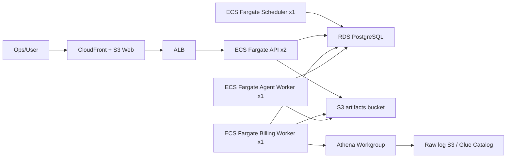

# Agent Workbench AWS 配置建议

生成时间：2026-06-22
依据：当前正在运行的 `agent-workbench` 实例、Postgres 历史任务状态、MinIO/S3 账单产物、Docker 资源采样，以及 AWS 官方规格文档。

## 结论

当前自动化出账没有真正持续失败。真实 Athena/S3 出账 job 都已完成，失败表象来自状态机缺口：`billing_batches` 在创建后停留在 `RENDERING`，worker 完成 `jobs`、`billing_runs`、`bill_documents` 后没有回写批次终态。

已修复为：

- 出账 job 完成后自动 reconcile 所属 batch 和 schedule run。
- worker 启动时自动修复历史卡在 `RENDERING` 的批次。
- 异常路径会把 job、run、预置 document 标失败，再收口 batch。
- 历史 3 个 batch 已校准为 `COMPLETED`，当前队列为 0，失败账单为 0。

建议生产从下面这一档起步：

| 组件 | 推荐配置 | 数量 | 说明 |
| --- | ---: | ---: | --- |
| Web | S3 + CloudFront | 1 | 前端是静态构建，不需要常驻容器 |
| API | ECS Fargate `0.5 vCPU / 1 GB` | 2 | ALB 后双副本，高可用即可 |
| Scheduler | ECS Fargate `0.25 vCPU / 0.5 GB` | 1 | 只负责定时入队 |
| Billing worker | ECS Fargate `2 vCPU / 8 GB`，ephemeral storage `50 GiB` | 1 | 真实出账核心，保持并发 1 |
| Agent worker | ECS Fargate `1 vCPU / 2 GB` | 1 | 仅在启用对账 Agent/Runner 时需要 |
| PostgreSQL | RDS PostgreSQL `db.t4g.large`，gp3 `50 GB`，autoscaling 到 `200 GB` | 1 | 生产建议 Multi-AZ |
| S3 | artifacts bucket + Athena results bucket | 2 | 账单产物和 Athena 查询结果分离 |
| Athena | 独立 Workgroup | 1 | Active DML quota 建议 >= 25 |

省钱起步可降到：RDS `db.t4g.medium`，Billing worker `1 vCPU / 4 GB`。但月结窗口余量较小，建议只用于试运行或低峰环境。

## 真实运行证据

当前运行环境确认：

```text
WORKBENCH_ATHENA_EXECUTION=real
ATHENA_E2E_MODE=real
RAW_LOG_S3_ENABLED=true
RAW_LOG_S3_BUCKET=ezmodel-log
RAW_LOG_S3_REGION=ap-southeast-1
RAW_LOG_S3_PREFIX=llm-raw-logs
```

最终状态：

| 指标 | 当前值 |
| --- | ---: |
| jobs | 4 个 `COMPLETED` |
| billing_runs | 4 个 `COMPLETED` |
| billing_batches | 3 个 `COMPLETED` |
| bill_documents | 159 个 `GENERATED` |
| queued/running jobs | 0 |
| failed documents | 0 |

历史 job 规模：

| 任务 | 账期/日期 | 调用量 | 用户/模型 | 输入/输出 tokens | 实际执行时长 |
| --- | ---: | ---: | ---: | ---: | ---: |
| `channel_cost_bill` | 2026-05 | 1,581,914 | 38 / 42 | 9.99B / 1.80B | 17.95 分钟 |
| `internal_customer_bill` | 2026-05 | 1,581,914 | 38 / 42 | 9.99B / 1.80B | 16.01 分钟 |
| `customer_invoice` | 2026-05 | 1,581,914 | 38 / 42 | 9.99B / 1.80B | 15.17 分钟 |
| `daily_channel_cost_snapshot` | 2026-06-20 | 0 | 0 / 0 | 0 / 0 | 7.66 分钟 |

账单文档拆分规模：

| 类型 | 文档数 |
| --- | ---: |
| `channel_cost_bill` | 51 |
| `internal_customer_bill` | 39 |
| `customer_invoice` | 39 |
| `daily_channel_cost_snapshot` | 30 |

对象存储采样：

| 项目 | 当前值 |
| --- | ---: |
| bucket | `agent-workbench` |
| object 数 | 1,420 |
| 总大小 | 735.49 MiB |
| `bills/` 前缀 | 733.32 MiB |
| `jobs/` 前缀 | 1.31 MiB |

最大对象样例：

| 对象类型 | 大小 |
| --- | ---: |
| 月度 detail CSV zip | 76.52 MiB |
| 最大用户 detail workbook | 59.35 MiB |
| 最大渠道 detail workbook | 52.66 MiB |
| customer detail CSV zip | 50.72 MiB |

Postgres 采样：

| 项目 | 当前大小 |
| --- | ---: |
| database | 16 MB |
| `bill_documents` | 3.9 MB |
| `jobs` | 1.8 MB |
| `billing_runs` | 568 KB |
| `uploaded_files` | 360 KB |

空闲资源采样：

| 容器 | CPU | 内存 |
| --- | ---: | ---: |
| API | 0.13% | 74.72 MiB |
| Billing worker | 0.00% | 44.67 MiB |
| Scheduler | 0.00% | 64.4 MiB |
| Web | 0.00% | 24.18 MiB |
| Postgres | 0.00% | 38.98 MiB |
| MinIO | 0.00% | 153 MiB |

## 推荐架构



## ECS/Fargate

AWS Fargate task-level CPU 和 memory 必须使用固定组合。推荐值都落在 AWS 支持范围内：`0.25 vCPU` 可配 `0.5/1/2 GB`，`0.5 vCPU` 可配 `1-4 GB`，`1 vCPU` 可配 `2-8 GB`，`2 vCPU` 可配 `4-16 GB`。参考：[Amazon ECS task definition parameters](https://docs.aws.amazon.com/AmazonECS/latest/developerguide/task_definition_parameters.html)。

Billing worker 推荐保留：

```text
WORKBENCH_JOB_CONCURRENCY_BILLING_RUN=1
WORKBENCH_WORKER_FAMILY=billing_run
WORKBENCH_ATHENA_EXECUTION=real
```

原因：

- 单个 billing job 内部已经会并行提交 Athena 查询。
- 当前 1.58M calls 的月账单在 15-18 分钟完成，瓶颈更像 Athena 查询和 XLSX/CSV 生成，而不是 API。
- 多个 Billing worker 横向并发会同时放大 Athena Active DML、临时文件和 Pandas/XLSX 内存峰值。

Fargate platform 1.4.0+ 默认有 20 GiB ephemeral storage，可配置到 200 GiB。当前一轮产物不到 1 GiB，但考虑镜像层、临时 CSV/XLSX、重跑和增长，Billing worker 建议配置 50 GiB。参考：[Fargate task ephemeral storage](https://docs.aws.amazon.com/AmazonECS/latest/developerguide/fargate-task-storage.html)。

## RDS PostgreSQL

当前 DB 只有 16 MB，Postgres 存的是任务状态、summary、文件索引和配置快照，不存放 1.58M 明细行。因此 RDS 不需要很大，生产主要买稳定性和运维余量。

| 场景 | 实例 | 存储 | 建议 |
| --- | --- | ---: | --- |
| 最小可用 | `db.t4g.medium` | gp3 20 GB，autoscaling 到 100 GB | 试运行、低成本 |
| 推荐生产 | `db.t4g.large` | gp3 50 GB，autoscaling 到 200 GB | Multi-AZ，月结稳态 |
| 增长后 | `db.t4g.xlarge` 或 M/R 系列 | 100 GB+ | 大量 Agent 事件、长审计留存 |

AWS 官方规格显示 `db.t4g.medium` 为 2 vCPU / 4 GiB，`db.t4g.large` 为 2 vCPU / 8 GiB。参考：[RDS DB instance class hardware specs](https://docs.aws.amazon.com/AmazonRDS/latest/UserGuide/Concepts.DBInstanceClass.Summary.html)。

建议开启：

- Automated backups：7-14 天起步。
- Performance Insights：上线初期打开，用来确认 DB 是否真是瓶颈。
- Storage autoscaling：避免 summary、文件索引、Agent 事件增长导致磁盘满。
- Multi-AZ：生产打开，试运行可先单 AZ。

## S3 与生命周期

当前完整月结产物约 735 MiB。按 1 GB/月估算：

| 保留策略 | 容量估算 |
| --- | ---: |
| 3 个月完整产物 | 3-5 GB |
| 12 个月完整产物 | 10-15 GB |
| 12 个月 + 重跑/增长余量 | 50-100 GB |

建议 bucket：

| 用途 | Bucket | 生命周期 |
| --- | --- | --- |
| 账单产物 | `agent-workbench-artifacts-prod` | 30-90 天 Standard，之后 Standard-IA |
| Athena 结果 | `athena-results-prod` | 7-30 天过期或转低频 |
| 原始日志 | 现有 raw log bucket | 按业务审计周期保留 |

S3 Lifecycle 可自动 transition 或 expire 对象。Standard-IA/One Zone-IA transition 需要对象至少存储 30 天。参考：[S3 Lifecycle 管理](https://docs.aws.amazon.com/AmazonS3/latest/userguide/object-lifecycle-mgmt.html) 和 [S3 Lifecycle transition considerations](https://docs.aws.amazon.com/AmazonS3/latest/userguide/lifecycle-transition-general-considerations.html)。

## Athena

当前出账读取真实 raw log S3，经 Athena 查询后由 worker 生成账单文件。Athena 是需要重点监控的外部瓶颈。

建议：

| 场景 | Athena 设置 |
| --- | --- |
| 当前规模 | 独立 Workgroup，Active DML quota >= 25 |
| 两个账期并行 | Active DML quota >= 50，或把代码内查询并发下调 |
| 高峰多租户 | 加队列化，必要时申请 quota 或使用 capacity reservation |

AWS Athena Active DML quota 包含 running 和 queued 查询。官方示例说明，如果 quota 是 25，而 running+queued 到 26，第 26 个查询会触发 `TooManyRequestsException`。参考：[Amazon Athena service quotas](https://docs.aws.amazon.com/athena/latest/ug/service-limits.html)。

## 扩容阈值

| 指标 | 当前证据 | 扩容阈值 | 动作 |
| --- | ---: | ---: | --- |
| 月调用量 | 1.58M | > 5M | Billing worker 升到 `4 vCPU / 16 GB` |
| 单 job 出账时长 | 15-18 分钟 | > 45 分钟 | 增 CPU 或优化 Athena 分区/查询 |
| 单轮产物大小 | 735 MiB | > 5 GB | ephemeral storage 升到 100 GiB |
| DB 大小 | 16 MB | > 20 GB | RDS 升级并检查 summary/索引 |
| Athena TooManyRequests | 暂未观察 | 任意出现 | 降低并发或申请 quota |
| Worker OOM/restart | 暂未观察 | 任意出现 | worker 内存翻倍 |

## 最小可用方案

适合先省钱跑通：

- Web：S3 + CloudFront。
- API：Fargate `0.25 vCPU / 0.5 GB`，1-2 副本。
- Scheduler：Fargate `0.25 vCPU / 0.5 GB`。
- Billing worker：Fargate `1 vCPU / 4 GB`，ephemeral storage 50 GiB。
- RDS：`db.t4g.medium`，20 GB gp3。
- S3：Standard，30-90 天后转 IA。

这档能支撑当前 1.58M calls/月的出账，但月结峰值余量较少。

## 推荐生产方案

用于当前业务量并保留 3-5 倍增长余量：

- Web：S3 + CloudFront。
- API：Fargate `0.5 vCPU / 1 GB`，2 副本，ALB。
- Scheduler：Fargate `0.25 vCPU / 0.5 GB`，1 副本。
- Billing worker：Fargate `2 vCPU / 8 GB`，1 副本，ephemeral storage 50 GiB。
- Agent worker：Fargate `1 vCPU / 2 GB`，1 副本。
- RDS PostgreSQL：`db.t4g.large`，Multi-AZ，gp3 50 GB，autoscaling 到 200 GB。
- S3：账单 artifacts bucket、Athena result bucket、raw log bucket 分离。
- Athena：独立 Workgroup，监控 DML 并发、失败率、扫描字节数。
- CloudWatch：日志保留 30-90 天，Billing worker 设置 CPU、memory、exit code 告警。

## 暂不建议

- 不建议一开始把 RDS 做很大。当前 DB 不是瓶颈。
- 不建议多个 Billing worker 同时跑月结，除非先设计 Athena 并发和队列控制。
- 不建议把账单产物放 EFS。S3 更适合归档、下载、生命周期和审计。
- 不建议前端继续作为常驻容器。当前静态前端更适合 S3/CloudFront。

## 待确认项

这些会影响最终成本，但不影响第一版 sizing：

- raw log bucket 每月新增量和分区质量。
- Athena 单次查询扫描字节数。
- 账单文件保留期、客户下载期、审计留存期。
- 是否要求 RDS Multi-AZ 和跨区灾备。
- Agent worker 是否从 fake mode 切到真实 LLM/Runner，以及并发会话数。
