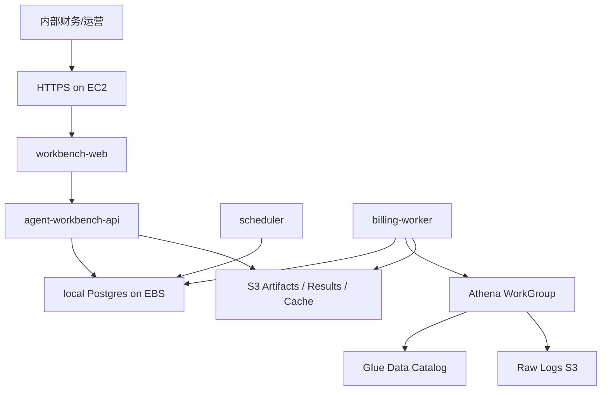

# Agent Workbench 账单自动化最终综合方案

## 1. 背景与目标

当前 Athena 账单系统已经具备确定性的出账内核：

- `bill_cli.py` 是账单 CLI 入口，支持按月、按用户、按渠道、客户视图、明细导出和 S3 上传。
- `queries.py` 负责生成 Athena SQL，从 `ezmodel_logs.usage_logs` 聚合用量并做去重。
- `athena_engine.py` 负责 Athena 查询、S3 查询缓存、结果下载和查询成本追踪。
- `pricing_engine.py` 负责基于 `pricing.json` / `discounts.json` 计算刊例价、客户收入、渠道成本、利润和毛利率。
- `report_builder.py` 负责生成 Excel、CSV 明细、异常页和查询成本页。

这个系统的意义是保住已有计费准确性，不重写账务逻辑。Workbench 的目标是在它之上补齐调度、批次、审计、发布和 UI，把“手动出账工具”升级为“账单自动化平台”。

正式账单必须真实生成。Workbench 可以保留 dry-run 用于本地 E2E 和命令审计，但生产路径必须实际执行 Athena Billing Worker，生成 Excel/CSV 等账单产物并归档。

## 2. 账单类型

账单类型必须显式化，不能只靠 `customer_view + channel_id` 隐式表达。

| bill_type | 面向对象 | 是否可外发 | 内容 |
| --- | --- | --- | --- |
| `customer_invoice` | 客户/租户 | 是 | 用量、模型、客户折扣后应付金额、客户版明细 |
| `internal_customer_bill` | 财务/运营 | 否 | 客户收入、渠道成本、利润、毛利率、折扣命中、异常 |
| `channel_cost_bill` | 渠道/供应商对账 | 默认否 | 渠道成本、模型成本、供应商差异、渠道对账状态 |
| `daily_channel_cost_snapshot` | 财务/运营 | 否 | 每日渠道成本快照、趋势和异常预警 |

客户版账单必须隐藏 `channel_id`、`cost_usd`、`profit_usd`、`cost_discount` 等内部字段。内部版和渠道账单保留完整成本、利润和折扣信息。

## 3. 性能与执行架构

月初出账采用“一次 Athena 物化，多路账单渲染”：

```text
数据水位检查
  -> 冻结 config_version
  -> Athena 生成 monthly billing fact
  -> S3/Parquet/CSV manifest 归档
  -> Render Worker 并发生成客户版、内部版、渠道账单
  -> 客户版审核发布
```

不能为每个客户、每个渠道重复扫描 Athena。Athena Worker 低并发生成事实表，Render Worker 基于事实表横向扩容渲染账单文件。

推荐部署拆分：

- `agent-workbench-api`：UI/API/任务查询，不直接跑重任务。
- `agent-workbench-scheduler`：单活调度每日和月初任务。
- `billing-athena-worker`：低并发执行 Athena 查询，生成 monthly billing fact。
- `billing-render-worker`：可横向扩容，生成 Excel/CSV/PDF。
- `agent-worker`：处理供应商差异、异常解释、计费口径建议。

## 4. 定时任务与批次

默认定时任务：

- 每日 `03:30 Asia/Hong_Kong`：生成前一天 `daily_channel_cost_snapshot`。
- 每月 1 号 `06:00 Asia/Hong_Kong`：生成上月 `customer_invoice`。
- 每月 1 号 `07:30 Asia/Hong_Kong`：生成上月 `internal_customer_bill` 和 `channel_cost_bill`。

核心数据模型：

- `schedules`：定时任务定义。
- `schedule_runs`：每次触发记录。
- `billing_batches`：月结批次。
- `billing_fact_manifests`：Athena 事实表产物索引。
- `bill_documents`：每份账单文件，包含 `bill_type`、`target_type`、`target_id`、`status`、`s3_uri`。
- `bill_publish_records`：客户版账单审核和发布记录。

幂等 key：

```text
schedule_id + period + bill_type + target_type + target_id + config_version_id + command_hash
```

同一 key 重复触发默认复用结果；显式 force rerun 才生成新 run。

## 5. UI 方案

Workbench 新增“账单自动化”模块：

- 总览页：展示今日/月结状态、最近日成本快照、失败数、待审核账单。
- 定时任务页：展示任务名称、类型、周期、时区、下次运行、上次运行、状态，支持启停、立即运行、补跑。
- 月结批次页：固定流水线为“数据水位 -> 事实表 -> 客户账单 -> 内部账单 -> 渠道账单 -> 审核/发布”。
- 账单文件页：按客户版、内部版、渠道账单分 Tab，客户版支持预览、下载、审核、发布。
- 配置与审计页：展示 `config_version`、pricing/discount 快照、SQL、command、操作者、重跑记录和产物 URI。

## 6. 多 Agent 并发开工

实现时按职责拆分，避免互相覆盖：

- Agent A：方案文档、README、架构文档。
- Agent B：数据库 schema 和 API。
- Agent C：Scheduler、批次、幂等、失败重试。
- Agent D：真实 Athena Worker 接入和 billing fact manifest。
- Agent E：Render Worker 和三类账单字段隔离。
- Agent F：账单自动化 UI。
- Agent G：fixture、Docker E2E、真实生成验收。

各 Agent 必须只改自己的文件范围，不回滚其他人的改动。

## 7. 验收标准

- 单个 `billing_run` 仍兼容现有手动创建和运行方式。
- `WORKBENCH_ATHENA_EXECUTION=real` 时会真实执行 `bill_cli.py` 并归档输出文件。
- 每日任务能生成 `daily_channel_cost_snapshot` 记录。
- 月初任务能生成 batch、fact manifest、客户版、内部版、渠道账单记录。
- 客户版账单产物不包含内部成本和利润字段。
- 同一账期重复触发不会重复生成相同账单，除非显式 force rerun。
- 单个客户或渠道失败后，只重试失败 target。
- UI 能查看定时任务、月结批次、账单文件、审核发布状态和审计信息。

## 8. AWS 部署

生产部署参考 [Agent Workbench AWS 部署文档](aws-deployment.md)。当前最终目标是内部低并发运行，因此推荐使用单台 EC2 + Docker Compose + S3 + Athena + Glue + CloudWatch，而不是一开始采用 ECS/RDS/ALB/NAT 全套高可用架构：



下面的图片是后续扩展到 ECS/RDS/ALB 时的参考架构，不作为当前内部版默认部署：


- `agent-workbench-api`、`agent-workbench-scheduler`、`billing-worker`、`workbench-web`、`postgres-workbench` 先部署在同一台 EC2 的 Docker Compose 中。
- `agent-workbench-api` 只负责 UI/API/状态查询，不直接执行 Athena 重任务。
- `agent-workbench-scheduler` 单活运行，负责每日和月初调度。
- `billing-worker` 低并发执行真实 Athena 出账，生产必须设置 `WORKBENCH_ATHENA_EXECUTION=real`。
- 后续如果并发和 SLA 提升，再迁移到 ECS Fargate + RDS PostgreSQL + ALB。
- 生产环境不得设置 `ATHENA_E2E_MODE=fixture`，也不使用本地 MinIO 的 `WORKBENCH_S3_ENDPOINT`。
- 账单、配置快照、执行命令、stdout/stderr、summary 和审核记录都归档到 S3；Workbench 状态先保存在 EC2 上的 Postgres，并通过每日 EBS snapshot 备份。
- 成本控制以 Athena 扫描量、EC2/EBS 规格、S3 lifecycle、CloudWatch Logs retention 为核心；上线前必须配置 AWS Budgets、Cost Anomaly Detection 和 Athena WorkGroup scanned bytes cutoff。
- 内部低并发版预算先按 `USD 100/month` 控制；低扫描量下预估约 `USD 63/month`，如果 Athena 每月扫描 10TB 则约 `USD 103/month`。
