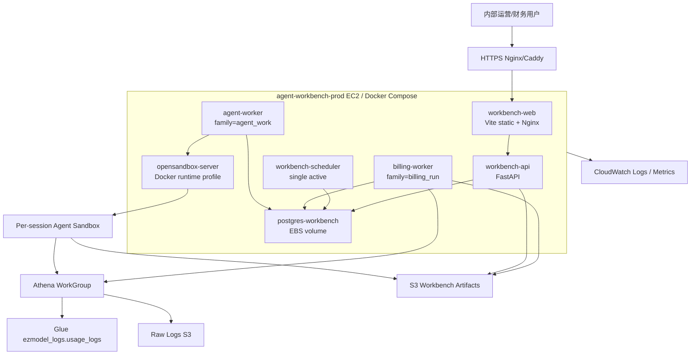

# Agent Workbench 现网部署方案（最新架构）

## 1. 部署结论

当前 Agent Workbench 面向内部财务/运营低并发使用，现网第一版建议采用：

```text
单台 EC2 + Docker Compose + EC2 本机 Postgres(EBS) + AWS S3 + Athena/Glue + CloudWatch
```

这个方案保留服务边界，但不先上 ECS/RDS/ALB/NAT 全套托管架构，原因是：

- 工作台用户少，主要瓶颈是 Athena 扫描量和账单渲染内存，不是 API 并发。
- Web/API/scheduler/billing-worker/agent-worker 已经可以用同一 API 镜像拆进程运行。
- 正式账单和 Agent 产物全部归档 S3，EC2 可重建。
- Postgres 只存状态、索引、配置版本和摘要，不存大明细；EBS snapshot 足以支撑第一阶段恢复。

后续当需要高可用、托管数据库或多副本 API 时，再迁到：

```text
S3/CloudFront Web + ECS Fargate API/Scheduler/Billing Worker + RDS PostgreSQL + OpenSandbox on ECS EC2/EKS
```

## 2. 最新架构边界

### 2.1 服务边界



### 2.2 业务能力边界

| 能力 | 承载服务 | 现网要求 |
| --- | --- | --- |
| 账单生成、账单库、重出账单 | `billing-worker` + `workbench-api` | 必须走真实 Athena；结果归档 S3；每份账单可从账单库触发重出 |
| 刊例价/折扣管理 | `workbench-api` + Postgres | 显式保存、二次确认；保存后生成配置版本；后续出账使用最新 active config |
| 账单库汇总 | `workbench-api` | 展示渠道/客户成本、刊例价、应付、利润等摘要；DB 只存 summary/index，大文件在 S3 |
| 对账 Agent | `agent-worker` + OpenSandbox | 支持实时 SSE、继续追问、toolcall 明细、Skills 自动注入、输出文件归档 S3 下载 |
| Agent 产物 | `agent-worker` + S3 | Agent 只能写 `output/`；结束后自动上传 S3，并在页面“产物”区下载 |
| Skills/经验库 | `workbench-api` + S3 + Postgres | Skills 内容写 S3，索引写 Postgres；会话按供应商/账期/类型自动注入，可排除 |
| 资料库/文件下载 | `workbench-api` + S3 | 浏览器通过 API 代理下载，避免暴露内网 S3 endpoint |
| 原始日志检索 | `workbench-api` | 只做高级排查入口；生产限制权限、前缀和下载范围 |

## 3. 资源规格

### 3.1 第一阶段现网规格

| 资源 | 建议 |
| --- | --- |
| EC2 | `t4g.large` 起步；低峰可降到 `t4g.medium`。月结/大账单窗口优先 `t4g.large` |
| EBS | gp3 100GB 起，挂载到 `/srv/agent-workbench`，Postgres data 单独目录 |
| Postgres | Docker `postgres:16-alpine`，数据目录在 EBS；每日 snapshot |
| S3 artifacts bucket | `ezmodel-agent-workbench-prod`，版本控制、SSE-S3 或 SSE-KMS、阻止 public access |
| S3 Athena results bucket | `ezmodel-athena-results-prod`，短 lifecycle |
| Athena WorkGroup | `agent-workbench-billing-prod`，设置 result location、bytes scanned cutoff |
| CloudWatch | 容器日志 30-90 天；磁盘、内存、任务失败告警 |
| IAM | EC2 instance role，最小 S3/Athena/Glue/CloudWatch 权限，不使用长期 AK/SK |

### 3.2 容器资源上限

| Compose service | CPU/内存建议 | 说明 |
| --- | --- | --- |
| `workbench-api` | 1 vCPU / 1-2GB | UI API、SSE、文件代理下载 |
| `workbench-scheduler` | 0.25-0.5 vCPU / 256-512MB | 单活定时创建任务 |
| `billing-worker` | 2 vCPU / 4-8GB | pandas/openpyxl 渲染账单，生产保持并发 1 |
| `agent-worker` | 1 vCPU / 2-4GB | 拉起 Agent runner；生产并发 1 起 |
| `opensandbox-server` | 1 vCPU / 1-2GB | 仅内网；需要 Docker socket |
| `workbench-web` | 0.25 vCPU / 256MB | Nginx 静态资源 |
| `postgres-workbench` | 1 vCPU / 1-2GB | 小库，重点是 EBS 备份 |

## 4. 目录与 S3 规划

### 4.1 EC2 目录

```text
/srv/agent-workbench/
  compose/
    docker-compose.yml
    .env
  postgres/
  jobs/
  logs/
  nginx/
  backups/
```

Postgres data 放 `/srv/agent-workbench/postgres`，该目录必须在独立 EBS 上。

### 4.2 S3 artifacts bucket

```text
s3://ezmodel-agent-workbench-prod/
  bills/
    {bill_type}/{yyyy}/{mm}/{target}/run-{id}/
      command.json
      stdout.log
      stderr.log
      summary.json
      generated/
  config/
    cfg-{id}/
      pricing.json
      discounts.json
      manifest.json
  uploads/
    supplier-bills/
    reconcile-evidence/
  agent/
    sessions/{session_id}/
      output/
      result.json
      report.md
      stdout.log
      stderr.log
  skills/
    {category}/{name}-{skill_id}/{version}/
      SKILL.md
      manifest.json
  audit/
```

保留策略：

- `bills/`、`config/`、`audit/`：按财务审计周期保留，建议 7 年。
- `agent/sessions/*/output/`：默认 180-365 天；重要报告可转长期。
- `athena-results/`：30-90 天。
- `athena-cache/`：30-180 天，按复跑收益调整。

## 5. 生产环境变量

### 5.1 通用

```bash
TZ=Asia/Hong_Kong
DATABASE_URL=postgresql://workbench:<password>@postgres-workbench:5432/agent_workbench
SESSION_SECRET=<long-random-secret>
WORKBENCH_API_TOKEN=<internal-api-token>
WORKBENCH_CORS_ORIGINS=https://workbench.example.com
WORKBENCH_MAX_UPLOAD_BYTES=104857600

WORKBENCH_S3_BUCKET=ezmodel-agent-workbench-prod
WORKBENCH_S3_REGION=ap-southeast-1
WORKBENCH_S3_ENDPOINT=

WORKBENCH_ATHENA_EXECUTION=real
ATHENA_E2E_MODE=
ATHENA_FIXTURE_DIR=
AWS_REGION=ap-southeast-1
```

生产 AWS 上不设置 `WORKBENCH_S3_ACCESS_KEY_ID` / `WORKBENCH_S3_SECRET_ACCESS_KEY`，由 EC2 IAM role 提供权限。

### 5.2 Athena / raw logs

```bash
ATHENA_WORKGROUP=agent-workbench-billing-prod
ATHENA_RESULT_BUCKET=ezmodel-athena-results-prod
ATHENA_RESULT_PREFIX=athena-results
ATHENA_CACHE_BUCKET=ezmodel-athena-results-prod
ATHENA_CACHE_PREFIX=athena-cache
RAW_LOG_S3_REGION=ap-southeast-1
WORKBENCH_RAWLOGS_S3_BUCKET=<raw-log-bucket>
WORKBENCH_RAWLOGS_PREFIX=llm-raw-logs
```

### 5.3 API

```bash
WORKBENCH_QUEUE_AUTO_DRAIN=false
AGENT_WORKBENCH_ENABLED=true
AGENT_WORKBENCH_E2E=false
OPEN_SANDBOX_URL=http://opensandbox-server:8080
OPEN_SANDBOX_API_KEY=<sandbox-api-key>
RUNNER_SANDBOX_ENABLED=true
RUNNER_SANDBOX_IMAGE=<ecr-or-local>/agent-workbench-api:<tag>
RUNNER_WORKSPACE_ROOT=/srv/agent-workbench/jobs
```

### 5.4 Billing worker

```bash
WORKBENCH_WORKER_FAMILY=billing_run
WORKBENCH_WORKER_POLL_SECONDS=10
WORKBENCH_WORKER_BATCH_LIMIT=1
WORKBENCH_JOB_CONCURRENCY_BILLING_RUN=1
WORKBENCH_RECOVER_RUNNING_ON_STARTUP=true
WORKBENCH_RECOVER_RUNNING_GRACE_SECONDS=60
WORKBENCH_ATHENA_REAL_TIMEOUT_SECONDS=21600
WORKBENCH_BILLING_JOB_RUN_TIMEOUT_SECONDS=21600
```

### 5.5 Agent worker

```bash
WORKBENCH_WORKER_FAMILY=agent_work
WORKBENCH_WORKER_POLL_SECONDS=3
WORKBENCH_WORKER_BATCH_LIMIT=1
WORKBENCH_JOB_CONCURRENCY_AGENT_WORK=1
WORKBENCH_AGENT_JOB_RUN_TIMEOUT_SECONDS=7200

RUNNER_MODE=sandbox
AGENT_MODE=claude_acp
RUNNER_AGENT_TIMEOUT_SECONDS=4800

ZHIPU_CODINGPLAN_MODEL=glm-5.2
ZHIPU_CODINGPLAN_API_KEY=<from-ssm-or-env-file>
ZHIPU_CODINGPLAN_ENDPOINT=https://open.bigmodel.cn/api/coding/paas/v4/chat/completions
ZHIPU_CODINGPLAN_ANTHROPIC_BASE_URL=https://open.bigmodel.cn/api/anthropic
ZHIPU_CODINGPLAN_ACP_MAX_ATTEMPTS=10
ZHIPU_CODINGPLAN_ACP_RETRY_BASE_SECONDS=8

CLAUDE_CODE_DISABLE_NONESSENTIAL_TRAFFIC=1
ENABLE_TOOL_SEARCH=0
CLAUDE_CODE_DISABLE_EXPERIMENTAL_BETAS=1
```

## 6. Docker Compose 现网形态

生产 compose 建议从 `docker-compose.e2e.yml + docker-compose.athena-prod.yml` 收敛出独立 `docker-compose.prod.yml`。关键差异：

- 删除 MinIO 或不启动 MinIO。
- `WORKBENCH_S3_ENDPOINT` 为空。
- `ATHENA_E2E_MODE` 和 `ATHENA_FIXTURE_DIR` 为空。
- `AGENT_MODE=claude_acp`。
- `workbench-api`、`billing-worker`、`agent-worker` 复用同一镜像。
- `workbench-web` 通过 Nginx/Caddy 暴露 HTTPS；API 只在 Docker 内网。
- `opensandbox-server` 只绑定内网，不暴露公网。

示例服务清单：

```text
postgres-workbench
workbench-api
workbench-scheduler
billing-worker
agent-worker
opensandbox-server
workbench-web
nginx/caddy
```

## 7. 上线步骤

### 7.1 Staging

1. 创建 staging S3 artifacts bucket、Athena result bucket、WorkGroup。
2. 准备 staging EC2、EBS、Security Group、IAM role。
3. 构建 API/Web 镜像并推到 ECR，或在 EC2 上拉代码本机构建。
4. 写入 `.env`，确保：
   - `WORKBENCH_ATHENA_EXECUTION=real`
   - `ATHENA_E2E_MODE=`
   - `WORKBENCH_S3_ENDPOINT=`
5. 启动 Postgres，执行 API 启动初始化 schema。
6. 启动 API/Web/scheduler/billing-worker/agent-worker。
7. 用单渠道、单日或小账期触发出账。
8. 校验账单库、文件下载、S3 artifacts、配置快照。
9. 创建 Agent 会话，引用账单库账单，确认：
   - SSE 实时消息正常。
   - toolcall 可展开。
   - 继续追问正常。
   - `output/` 文件自动上传 S3，并能在页面下载。
10. 验证折扣/价格显式保存与二次确认后，再重出一份账单。

### 7.2 Production

1. 冻结发布窗口，确认上月 raw log 数据水位。
2. 备份当前 Postgres EBS snapshot。
3. 部署新镜像 tag。
4. 先启动 API/Web，确认 `/health` 和页面可用。
5. 启动 scheduler。
6. 启动 billing-worker，保持并发 1。
7. 启动 agent-worker 和 opensandbox-server。
8. 手动触发一个低风险账单重出或单渠道出账。
9. 校验：
   - `jobs` / `billing_runs` / `bill_documents` 状态终态正确。
   - S3 有 `summary.json`、`stdout.log`、`stderr.log`、generated xlsx/csv。
   - 账单库摘要可见，下载可用。
   - Agent 会话可继续追问，产物下载可用。
10. 开启正式 schedule。

## 8. 发布与回滚

### 8.1 发布

- 使用镜像 tag = git short sha。
- `workbench-api`、`billing-worker`、`agent-worker` 使用同一 API 镜像 tag。
- Web 使用同一 git sha 构建。
- 发布顺序：Postgres snapshot -> API/Web -> scheduler -> billing-worker -> agent-worker。

### 8.2 回滚

回滚分两层：

1. **应用回滚**：切回上一组 API/Web 镜像 tag，重启容器。
2. **数据回滚**：仅在 schema 或配置误写严重时恢复 EBS snapshot；账单产物以 S3 为准，不删除历史对象。

配置误保存时优先做“新配置版本修正 + 重出账单”，不要直接改历史 config snapshot。

## 9. 监控与告警

| 监控项 | 告警条件 |
| --- | --- |
| API `/health` | 5 分钟不可用 |
| API 5xx | 连续 5 分钟超过阈值 |
| SSE 连接 | Agent 会话长时间无事件且 job RUNNING |
| Scheduler heartbeat | 10 分钟无 tick |
| QUEUED jobs | 持续增长 30 分钟 |
| RUNNING jobs | 超过 timeout |
| FAILED jobs | 任一生产月结批次失败 |
| Billing worker memory | 超过 80% 持续 10 分钟 |
| EC2 disk | EBS 使用超过 75% |
| Athena scanned bytes | 单次/单日超过 WorkGroup 预算 |
| S3 Put/Get | 出现 4xx/5xx |
| Agent retry | ACP retry 达到 10 次或 run.error |

日志必须包含：

```text
job_id
session_id
billing_run_id
bill_document_id
config_version_id
athena_query_execution_id
s3_uri
tool_call_id
status
duration_ms
error_message
```

## 10. 安全控制

- EC2 security group 只开放 `443`；SSH 使用 SSM Session Manager 或堡垒机。
- API 使用 `WORKBENCH_API_TOKEN`，Web 通过同域反代调用 API。
- S3 bucket block public access；下载通过 API 代理或受控 presigned URL。
- EC2 IAM role 最小授权到指定 bucket/prefix、Athena WorkGroup、Glue database/table。
- OpenSandbox 不开放公网；Docker socket 只给 opensandbox-server。
- Sandbox 禁止访问宿主敏感目录；`allowed_host_paths` 只允许 jobs workspace。
- Agent 子进程只在启动时注入必要凭证；不把 API key 写 DB、S3、stdout/stderr。
- 价格/折扣保存必须显式确认；生产配置变更生成新版本并可审计。
- 客户账单发布需要保留操作者、时间、文件 URI 和配置版本。

## 11. 灾备与数据恢复

| 数据 | 主存储 | 备份 |
| --- | --- | --- |
| Postgres 状态/索引 | EC2 EBS | 每日 EBS snapshot，保留 7-30 天 |
| 账单产物 | S3 artifacts | S3 versioning + lifecycle |
| 配置快照 | S3 `config/` + DB | S3 versioning |
| Agent 产物 | S3 `agent/sessions/` | lifecycle；重要报告转长期 |
| Skills | S3 `skills/` + DB index | S3 versioning |
| Raw logs | 现有 raw log S3 | 由原日志系统负责 |

EC2 故障恢复：

1. 新建 EC2，挂载最新 EBS snapshot。
2. 拉取同一镜像 tag 和 `.env`。
3. 启动 Postgres/API/Web。
4. 启动 worker 前先检查 RUNNING jobs，必要时由 `WORKBENCH_RECOVER_RUNNING_ON_STARTUP=true` 回收。
5. 对失败/中断账单执行重出。

## 12. 验收清单

上线前必须全部通过：

- [ ] 生产 `.env` 无 MinIO endpoint、无 fixture mode。
- [ ] EC2 IAM role 可读 raw logs、可写 artifacts、可执行 Athena。
- [ ] `/health` 正常。
- [ ] Web 可访问，API token/CORS 正常。
- [ ] 单渠道账单生成完成，S3 产物齐全。
- [ ] 账单库可展示成本、利润、刊例价、应付和下载。
- [ ] 任意账单可触发重出，并生成新 run/document。
- [ ] 价格/折扣保存需要显式保存和二次确认。
- [ ] Agent 可引用账单库、实时显示 toolcall、继续追问。
- [ ] Agent 输出 `output/` 文件能上传 S3 并在页面下载。
- [ ] Skills 注入、排除、保存经验正常。
- [ ] CloudWatch/EBS/S3/Athena 告警已配置。
- [ ] 回滚镜像 tag 和 EBS snapshot 已记录。

## 13. 演进路线

第一阶段上线后，建议按以下顺序演进：

1. Web 静态资源迁到 S3 + CloudFront。
2. Postgres 从 EC2/EBS 迁到 RDS PostgreSQL。
3. API/scheduler/billing-worker 迁到 ECS Fargate。
4. Billing worker 拆成 fact materializer 与 render worker。
5. Agent/OpenSandbox 从单 EC2 迁到 ECS on EC2 或 EKS。
6. 用 Terraform/CDK 管理 VPC、IAM、S3、Athena、ECR、CloudWatch、ECS/RDS。
