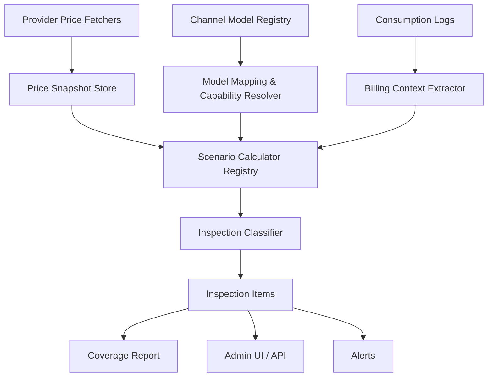

# 价格巡检框架完整方案

## 1. 背景与结论

当前已经实现了 OpenRouter 价格巡检的第一版能力：可以拉取 OpenRouter 价格快照，扫描 OpenRouter 渠道消费日志，按历史价格和日志用量复算 `expected_quota`，再与系统实际扣费 `logs.quota` 做比较。

但从现有 DB 已接入模型看，系统并不只有 OpenRouter 文生文模型。现有模型覆盖 Gemini、Claude、OpenAI、Azure、VertexAI、Anthropic、Kling、Vidu、Sora、DoubaoVideo、MiniMax、DeepSeek、VolcEngine 等多类渠道和模型形态。继续把所有问题都塞进 `openrouter_billing_inspection` 会导致两个问题：

- OpenRouter 价格源只能覆盖一部分模型，不能代表所有 provider 的真实价格规则。
- 文生文、文生图、图文生图、vision、cache、tool call、embedding、video/task 的计费形态不同，不能用一套 token 公式硬算。

因此建议把能力升级为通用的“价格巡检框架”：

```text
价格源快照
  -> 模型映射与能力识别
  -> 日志计费上下文提取
  -> 场景化复算器
  -> actual_quota 对比 expected_quota
  -> 覆盖率、异常、风险、告警、运营报表
```

核心结论：

- 这仍然是价格巡检，不是账单对账。
- 对比对象仍然是系统实际扣费 `logs.quota`。
- OpenRouter 只是第一类价格源，不应该成为框架边界。
- 现阶段可优先稳定覆盖“OpenRouter + 标准文生文”，再扩展 Gemini、Claude、OpenAI 的复杂场景。

## 2. 当前 DB 覆盖评估

基于当前 DB 的 `channels.models` 去重模型名做初步扫描：

| 指标 | 数量 |
|---|---:|
| DB 中去重模型名 | 119 |
| 能直接或归一化匹配 OpenRouter 价目表 | 27 |
| 当前计算器可稳定复算的文生文模型 | 24 |
| 匹配价格但因图像/多模态暂不支持复算 | 3 |
| 缺少价格映射或不适合 OpenRouter 巡检 | 92 |

这说明当前能力不能宣称“已接入模型都能适配”。更准确的判断是：

- OpenAI/Gemini/DeepSeek/Zhipu/Moonshot 的部分文生文模型可以适配。
- Claude 大量别名和版本名需要显式模型映射。
- Gemini/OpenAI 图像模型需要补图像 token、按次价格或 provider usage cost。
- Kling/Vidu/Sora/DoubaoVideo 等视频或任务型模型不纳入本轮价格巡检支持范围，只在覆盖率报表中标记为 `out_of_scope`。

当前覆盖可以分为四类：

| 分类 | 说明 | 处理策略 |
|---|---|---|
| 已可靠适配 | 价格匹配，日志字段足够，复算器支持 | 纳入异常统计 |
| 可适配但缺映射 | 本地模型名与价格源 model id 不一致 | 补模型映射表和别名规则 |
| 可适配但缺日志字段 | 有价格，但缺 image/cache/tool 等明细 | 补日志计费上下文字段 |
| 不纳入范围 | Kling/Vidu/Sora/DoubaoVideo 等 video/task 模型 | 标记 out_of_scope，不计入待支持缺口 |
| 暂不适配 | 一口价、非 OpenRouter 价格体系 | 标记 unsupported，后续按业务价值评估 |

## 3. 目标与非目标

### 3.1 目标

价格巡检框架需要回答的问题是：

```text
系统对这条请求实际扣掉的 quota，是否符合该请求发生时的价格规则和计费上下文？
```

核心公式：

```text
actual_quota   = logs.quota
expected_quota = PriceSource + BillingContext + Calculator 复算出的应扣 quota
delta_quota    = actual_quota - expected_quota
```

目标能力：

- 支持多价格源：OpenRouter、OpenAI、Anthropic、Google/Gemini、Azure、VertexAI 等。
- 支持多计费场景：文生文、vision、文生图、图文生图、cache read/write、tool call、embedding。
- 明确排除 Kling/Vidu/Sora/DoubaoVideo 等视频或任务型模型。
- 支持历史价格快照，避免用当前价格误判历史请求。
- 支持模型映射与覆盖率报表，清楚知道哪些模型能巡检、哪些不能。
- 支持异常分级、原因归类、明细追踪和人工排查。
- 支持后台页面、手动回放、定时巡检和告警。

### 3.2 非目标

本框架不做以下事情：

- 不拉取 provider 账单做余额或账单对账。
- 不复用或混入现有 recon 模块。
- 不根据 OpenRouter 余额变化判断系统扣费是否正确。
- 不自动修复余额、补扣、退款或变更用户资金。
- 不把 unsupported 场景硬判成 abnormal。
- 不用当前 provider 价格直接检查长时间之前的历史日志。

## 4. 总体架构

建议从 OpenRouter 专项模块演进为通用框架：



框架拆分：

| 模块 | 职责 |
|---|---|
| PriceSourceAdapter | 拉取 provider 价格、解析模型价格、保存快照 |
| ModelResolver | 将本地模型名解析到 provider model id 和计费能力 |
| BillingContextExtractor | 从 `logs` 和 `logs.other` 提取请求发生时的计费上下文 |
| Calculator | 按场景复算 expected quota |
| Classifier | 计算差异，输出 normal/warning/abnormal/critical/missing/unsupported |
| CoverageReporter | 输出模型覆盖率、缺失映射、缺字段、unsupported 原因 |
| Scheduler | 定时拉价格、定时巡检、手动回放 |
| AlertManager | 聚合异常并通知 |

## 5. 数据模型设计

### 5.1 价格源表

建议新增通用表：

```text
price_sources
```

字段：

```text
id
provider                openrouter/openai/anthropic/google/azure/vertexai/custom
name
enabled
fetch_interval_seconds
last_fetch_at
last_fetch_status
last_fetch_error
metadata_json
created_at
updated_at
```

说明：`kling`、`vidu`、`sora` 等视频/任务型 provider 只用于覆盖率扫描时识别并标记 `out_of_scope_video_task`，不进入价格源定时拉取、价格快照维护和巡检复算。

### 5.2 通用价格快照表

```text
price_model_snapshots
```

字段：

```text
id
source_provider
source_model_id
canonical_model_id
local_model_name
fetched_at
effective_at
currency
unit
input_text_price
output_text_price
input_image_price
output_image_price
input_audio_price
output_audio_price
cache_read_price
cache_write_price
cache_write_5m_price
cache_write_1h_price
request_price
image_price
video_price
tool_call_price
embedding_price
is_free
pricing_scheme
raw_json
created_at
```

重要设计：

- `fetched_at` 表示拉取时间。
- `effective_at` 表示价格生效时间，如果 provider 不提供，则默认等于 `fetched_at`。
- 价格字段保持 decimal，不使用 float。
- `raw_json` 必须保留，避免 provider 新字段无法立刻结构化。
- `pricing_scheme` 用于区分 `per_token`、`per_request`、`per_image`、`per_second`、`tiered`、`custom`。

### 5.3 模型映射表

```text
price_model_mappings
```

字段：

```text
id
channel_id
channel_type
local_model_name
source_provider
source_model_id
canonical_model_id
scenario
priority
enabled
confidence
note
created_at
updated_at
```

匹配优先级：

```text
channel_id + local_model_name 显式映射
channel_type + local_model_name 显式映射
local_model_name + source_provider 显式映射
完整 model id 精确匹配
去 provider 前缀后的 local name 精确匹配
大小写/空格/下划线/短横线归一化匹配
别名规则匹配
无法匹配 -> missing_model_mapping
```

### 5.4 巡检运行表

```text
price_inspection_runs
```

字段：

```text
id
status
trigger_type
source_provider
channel_id
channel_type
model_name
window_start
window_end
started_at
finished_at
total_logs
checked_logs
normal_count
warning_count
abnormal_count
critical_count
missing_count
unsupported_count
failed_count
summary_json
created_at
```

### 5.5 巡检明细表

```text
price_inspection_items
```

字段：

```text
id
run_id
log_id
created_at
channel_id
channel_type
source_provider
model_name
source_model_id
canonical_model_id
scenario
price_snapshot_id
actual_quota
expected_quota
delta_quota
diff_rate
actual_usd
expected_usd
support_level
status
reason_code
reason_detail
billing_context_json
calculator_trace_json
created_record_at
```

### 5.6 覆盖率报表表

```text
price_inspection_coverage_reports
```

字段：

```text
id
generated_at
source_provider
channel_type
model_name
scenario
mapping_status
calculator_status
log_context_status
support_level
sample_log_count
last_seen_at
reason_code
suggestion
raw_json
created_at
```

这个表很关键。没有覆盖率报表，巡检框架会长期处于“看似跑了很多任务，但不知道盲区在哪里”的状态。

## 6. 核心抽象

### 6.1 PriceSourceAdapter

接口职责：

```text
FetchPrices(ctx) -> []PriceSnapshot
NormalizeModel(raw) -> CanonicalModel
DetectCapabilities(raw) -> ModelCapabilities
```

第一批 adapter：

| Adapter | 用途 | 第一阶段策略 |
|---|---|---|
| OpenRouter | 已实现基础快照 | 继续作为主路径 |
| OpenAI | OpenAI 官方价格 | 先支持 text/image/embedding |
| Anthropic | Claude 官方价格 | 先支持 text/cache |
| Google | Gemini 官方价格 | 先支持 text/image |
| Azure | Azure OpenAI 价格 | 可先通过模型映射到 OpenAI calculator |
| Custom | 系统自定义模型价格 | 用于无法在线拉价的 provider |

### 6.2 ModelCapabilities

模型能力不要只靠模型名判断，应沉淀为结构：

```text
input_modalities:  text/image/audio/video
output_modalities: text/image/audio/video
supports_cache_read
supports_cache_write
supports_tools
supports_embedding
pricing_scheme
max_context_tokens
provider_family
```

能力来源优先级：

```text
provider metadata
显式模型映射配置
系统渠道配置
模型名启发式规则
unknown
```

### 6.3 BillingContext

巡检计算器不应直接读取松散的 `logs.other`，应先归一成统一上下文：

```text
log_id
request_id
channel_id
channel_type
source_provider
model_name
source_model_id
scenario
actual_quota
group_ratio
cond_multiplier
model_ratio
completion_ratio
input_text_tokens
output_text_tokens
input_image_tokens
output_image_tokens
input_audio_tokens
output_audio_tokens
cache_read_tokens
cache_write_tokens
cache_write_5m_tokens
cache_write_1h_tokens
tool_call_counts
image_count
video_seconds
provider_usage_cost
provider_usage_raw
runtime_billing_raw
```

字段来源优先级：

```text
provider usage cost
logs.other 中的结构化计费字段
logs.prompt_tokens / logs.completion_tokens
当前配置兜底，但标记 estimated
无法确认则 missing 或 unsupported
```

### 6.4 CalculatorRegistry

按场景注册计算器：

```text
text_token
vision_input
image_generation
image_edit
cache_read_write
tool_call
embedding
audio
video_task
per_request
tiered
custom
```

每个计算器输出：

```text
expected_quota
expected_cost
currency
support_level
reason_code
trace
```

`support_level`：

```text
exact       使用 provider usage.cost 或完整同源上下文
standard    使用历史价格快照和完整 token 明细
estimated   使用当前配置或不完整上下文
unsupported 不具备可靠复算条件
```

第一阶段只把 `exact` 和 `standard` 纳入异常统计。`estimated` 和 `unsupported` 只进入覆盖率和风险报表。

## 7. 常见模型场景支持方案

### 7.1 文生文

适用模型：

```text
OpenAI GPT
Claude
Gemini text
DeepSeek
Moonshot
Zhipu
MiniMax text
其他兼容 text 模型
```

复算公式：

```text
expected_cost =
  input_text_tokens  * input_text_price
+ output_text_tokens * output_text_price
+ cache_read_tokens  * cache_read_price
+ cache_write_tokens * cache_write_price

expected_quota = round(expected_cost * QuotaPerUnit * group_ratio * cond_multiplier)
```

支持要求：

- 有历史价格快照。
- 有可靠 input/output token。
- 有请求发生时的 `group_ratio` 和条件倍率。
- 模型映射明确。

### 7.2 Claude

需要覆盖：

```text
text -> text
vision input -> text
cache read
cache creation
long context / tiered pricing
```

第一阶段：

- 支持普通 text input/output。
- 支持 `cache_tokens` 作为 cache read。
- 缺 cache creation 明细时标记 unsupported。
- Claude >200K 或 tiered pricing 未完整记录时标记 unsupported。

系统需要补充日志字段：

```text
anthropic_model_id
input_text_tokens
input_image_tokens
output_text_tokens
cache_read_tokens
cache_write_tokens
cache_write_5m_tokens
cache_write_1h_tokens
long_context_tier
provider_usage_cost
```

### 7.3 Gemini

需要覆盖：

```text
text -> text
text + image -> text
text -> image
text + image -> image
embedding
```

第一阶段：

- 支持 Gemini 文生文。
- vision 在能拆出 image input token 时支持，否则 unsupported。
- 图像生成优先使用 provider/OpenRouter `usage.cost`，否则需要 image output token 或按次价格。

系统需要补充日志字段：

```text
google_model_id
input_text_tokens
input_image_tokens
output_text_tokens
output_image_tokens
image_output_count
image_output_tokens_per_image
embedding_input_tokens
provider_usage_cost
```

### 7.4 OpenAI

需要覆盖：

```text
Chat Completions text
Responses text
vision input
image generation
image edit
embedding
web search / file search
```

第一阶段：

- 支持 text input/output。
- image generation 和 image edit 不套用文本 completion price。
- tool call 缺调用次数或固定价格时标记 unsupported。
- embedding 使用独立 embedding calculator。

系统需要补充日志字段：

```text
openai_model_id
endpoint_type
input_text_tokens
input_image_tokens
output_text_tokens
output_image_tokens
image_count
image_size
image_quality
embedding_input_tokens
web_search_call_count
file_search_call_count
provider_usage_cost
```

### 7.5 Azure OpenAI

Azure 渠道的模型常常与 OpenAI 同名，但价格不一定相同。

处理原则：

- 如果 Azure 渠道配置明确映射到 OpenAI 官方同价模型，可复用 OpenAI calculator。
- 如果不同 region/deployment 有不同价格，必须按 `channel_id + deployment/model` 建显式映射。
- 不允许仅按 `gpt-xxx` 名称直接套 OpenAI 价格并输出 high confidence。

### 7.6 视频和任务型模型

以下模型不纳入当前价格巡检框架的支持范围：

```text
Kling
Vidu
Sora
DoubaoVideo
部分 VolcEngine task 模型
```

这些模型通常按：

```text
请求次数
视频秒数
清晰度
比例
模式
任务类型
失败/取消策略
```

计费，不适合 OpenRouter token 公式，也不是当前业务希望支持的巡检范围。

处理策略：

- 统一标记 `out_of_scope_video_task`。
- 在覆盖率报表中展示模型、渠道、调用量。
- 不进入 `missing` 或 `unsupported` 待支持缺口统计。
- 不建立 `video_task` calculator。

## 8. 异常分类与阈值

状态：

```text
normal
warning
abnormal
critical
missing
unsupported
out_of_scope
failed
```

默认阈值：

```text
abs(delta_quota) <= 2 quota        normal
diff_rate <= 0.5%                  normal
0.5% < diff_rate <= 2%             warning
2% < diff_rate <= 5%               abnormal
diff_rate > 5%                     critical
```

低金额保护：

```text
expected_quota < 100  时 abs(delta_quota) <= 5  仍为 normal
expected_quota < 1000 时 abs(delta_quota) <= 10 仍为 normal
```

常见 reason_code：

```text
ok
rounding_tolerance
overcharged
undercharged
missing_price_snapshot
missing_model_mapping
missing_provider_model_id
missing_usage_tokens
missing_runtime_ratio
unsupported_image_tokens
unsupported_audio_tokens
unsupported_tool_charge
out_of_scope_video_task
unsupported_tiered_pricing
unsupported_model_price
price_snapshot_after_log
calculator_error
```

## 9. API 设计

### 9.1 价格源管理

```text
GET  /api/price_inspection/sources
POST /api/price_inspection/sources/:provider/fetch
GET  /api/price_inspection/snapshots
```

当前落地状态：

| API | 当前能力 |
|---|---|
| `GET /sources` | 返回 OpenRouter、OpenAI、Anthropic/Claude、Google/Gemini、Azure 的价格源能力清单。 |
| `POST /sources/openrouter/fetch` | 已接入 OpenRouter 官方 models API，拉取并保存价格快照。 |
| `POST /sources/{openai,anthropic,google}/fetch` | 通过 catalog adapter 写入通用价格快照；Azure 仍返回 unsupported，不静默伪成功。 |
| `GET /snapshots?source_provider=openrouter` | 分页查询 OpenRouter 价格快照，支持按 `model_id`、`local_model_name`、`fetched_start`、`fetched_end` 过滤。 |
| `GET /coverage/export` | 按当前筛选导出覆盖率 CSV，用于审查现有 DB 已接入模型的适配情况。 |

OpenAI、Anthropic、Google、Azure 都可以通过日志中的 `billing.provider_usage_cost` 做 `exact` 巡检；OpenAI、Anthropic、Google 也已经可以通过 catalog 价格快照覆盖缺少 provider cost 的复算场景。

### 9.2 覆盖率报表

```text
POST /api/price_inspection/coverage/generate
GET  /api/price_inspection/coverage
GET  /api/price_inspection/coverage/summary
```

返回字段：

```text
model_name
channel_type
source_provider
mapping_status
calculator_status
support_level
reason_code
sample_log_count
suggestion
```

### 9.3 巡检任务

```text
POST /api/price_inspection/run
GET  /api/price_inspection/runs
GET  /api/price_inspection/issues
GET  /api/price_inspection/items
GET  /api/price_inspection/summary
```

运行请求示例：

```json
{
  "source_provider": "openrouter",
  "window_start": 1780930800,
  "window_end": 1780934400,
  "channel_id": 104,
  "model_name": "gpt-5.4-mini",
  "limit": 1000,
  "trigger_type": "manual",
  "include_legacy": false
}
```

字段说明：

| 字段 | 说明 |
|---|---|
| `source_provider` | 价格源/provider，支持 `openrouter`、`openai`、`anthropic`、`google`、`azure`。`gemini` 会归一化为 `google`，`claude` 会归一化为 `anthropic`。 |
| `window_start` / `window_end` | 巡检日志窗口，Unix 秒。为空时默认检查最近窗口。 |
| `channel_id` / `channel_type` / `model_name` | 可选过滤条件，用于手动回放或缩小排查范围。 |
| `limit` | 单次最多扫描日志数，避免大窗口拖垮数据库。 |
| `include_legacy` | 是否纳入没有 `other.billing` 的旧日志。默认 false，避免旧日志字段不全导致误报。 |

### 9.4 模型映射管理

```text
GET  /api/price_inspection/model_mappings
POST /api/price_inspection/model_mappings
PUT  /api/price_inspection/model_mappings/:id
POST /api/price_inspection/model_mappings/suggest
```

`suggest` 根据价格快照、本地模型名、渠道类型和归一化规则生成建议，但必须人工确认后启用。

## 10. 后台页面设计

已新增首版后台页面：

```text
控制台 / 价格巡检
/console/price-inspection
```

页面模块：

| 模块 | 内容 |
|---|---|
| 概览 | 最近巡检状态、异常数、覆盖率、价格快照状态 |
| 覆盖率 | 已支持/缺映射/缺字段/unsupported 模型列表 |
| 运行记录 | 每次任务窗口、统计、耗时、失败原因 |
| 问题聚合 | 按 provider、模型、渠道、状态、reason 聚合可处理问题 |
| 异常明细 | log_id、模型、渠道、actual、expected、delta、reason |
| 模型映射 | 本地模型名到价格源 model id 的映射管理 |
| 价格快照 | provider、model id、价格、生效时间 |
| 手动回放 | 指定时间、渠道、模型重跑 |

当前首版已覆盖：

- 价格源能力清单与 OpenRouter 价格快照拉取入口。
- 覆盖率概览、覆盖率报表生成和过滤。
- 手动运行巡检与 run 列表。
- 问题聚合列表，默认聚合 `warning`、`abnormal`、`critical`、`missing`、`failed`，排除 `unsupported` 和 `out_of_scope`。
- 巡检 item 明细过滤，用于定位 `logs.quota` 与 expected quota 差异。
- 模型映射列表和 OpenRouter 映射建议创建入口。

第一版页面重点不是做复杂图表，而是让管理员能快速回答：

```text
哪些模型已经能巡检？
哪些模型不能巡检？
不能巡检是因为缺价格、缺映射、缺日志字段，还是计算器未支持？
异常是多扣还是少扣？
```

## 11. 调度与告警

### 11.1 价格快照

建议频率：

```text
OpenRouter: 每 6 小时
OpenAI: 每 24 小时或手动维护
Anthropic: 每 24 小时或手动维护
Google/Gemini: 每 24 小时或手动维护
视频/任务型 provider: 本轮不纳入自动价格快照与巡检支持，只标记 out_of_scope
```

拉取失败策略：

- 重试 3 次。
- 使用最近有效快照继续巡检。
- 对没有历史快照的日志输出 `missing_price_snapshot`。

### 11.2 巡检任务

建议频率：

```text
每 15 分钟运行一次
检查最近 30 分钟日志
跳过最近 3 到 5 分钟日志
```

当前实现使用以下环境变量控制通用价格巡检 worker，默认关闭：

```text
PRICE_INSPECTION_ENABLED=false
PRICE_INSPECTION_INTERVAL_MINUTES=15
PRICE_INSPECTION_WINDOW_MINUTES=30
PRICE_INSPECTION_DELAY_MINUTES=5
PRICE_INSPECTION_LIMIT=5000
PRICE_INSPECTION_SOURCE_PROVIDERS=openrouter,openai,anthropic,google,azure
PRICE_INSPECTION_INCLUDE_LEGACY=false
```

worker 会按 `PRICE_INSPECTION_SOURCE_PROVIDERS` 逐个 provider 生成独立 run，统一写入 `price_inspection_runs` 和 `price_inspection_items`。这能让 OpenRouter、OpenAI、Claude/Anthropic、Gemini/Google、Azure 的巡检结果在同一套框架下查询，同时保留 provider 维度的隔离。

跳过最近日志的原因：

- 避免流式请求刚结束但日志尚未完整落库。
- 避免异步补写 usage 或扣费上下文还未完成。

### 11.3 告警策略

第一阶段只对高可信结果告警：

```text
support_level in (exact, standard)
status in (abnormal, critical)
```

触发条件：

```text
critical_count > 0
abnormal_count >= 10
同一 channel_id 连续 3 轮 abnormal
同一 model_name 平均 diff_rate > 2%
missing_model_mapping 数量突然增加
coverage_rate 连续下降
```

告警内容必须包含：

```text
巡检窗口
渠道
模型
价格源
实际扣费
预期扣费
差异
原因
样例 log_id
价格快照时间
建议动作
```

## 12. 实施路线

### 阶段一：框架化现有 OpenRouter 能力

目标：

```text
把已实现的 OpenRouter 巡检从专项模块抽象成通用价格巡检框架雏形。
```

范围：

- 保留当前 OpenRouter 快照和巡检能力。
- 新增通用 service 抽象：adapter、resolver、extractor、calculator、classifier。
- 新增覆盖率扫描能力。
- 新增通用 run/item 表，或在兼容期内由 OpenRouter 表同步写入通用表。
- 生成现有 DB 模型覆盖率报表。

验收标准：

- 可以回答 119 个已接入模型中哪些能巡检、哪些不能。
- OpenRouter 文生文巡检结果与当前实现一致。
- unsupported 不进入异常统计。

### 阶段二：补模型映射和日志上下文

目标：

```text
提升 Gemini、Claude、OpenAI 常见模型的覆盖率。
```

范围：

- 建立 `price_model_mappings`。
- 增加 mapping suggestion。
- relay 层落库 provider model id、provider usage cost、结构化 token 明细。
- 对 OpenRouter 返回的 `usage.cost` 优先落库。
- 梳理 Claude/Gemini/OpenAI 常见别名。

验收标准：

- 文生文模型可巡检覆盖率显著提升。
- 新增请求的 `support_level=exact` 占比提升。
- 缺模型映射和缺日志字段原因可被后台清晰展示。

### 阶段三：扩展复杂计算器

目标：

```text
覆盖 Gemini、Claude、OpenAI 的主流复杂计费场景。
```

范围：

- Claude cache write、长上下文/tiered。
- Gemini image input/output。
- OpenAI image generation/edit。
- OpenAI Responses tool call。
- Embedding。
- Per request / per image 场景。

验收标准：

- Gemini/Claude/OpenAI 的 text、vision、image 主路径可巡检。
- 每种计算器有单元测试和真实日志样例回放。
- 图像和 tool 场景不再大量落入 unsupported。

### 阶段四：运营化

目标：

```text
把巡检变成可日常使用的运营工具。
```

范围：

- 后台完整页面。
- 告警聚合。
- CSV 导出。
- 异常聚合到模型、渠道、用户、分组。
- 回放和批量补跑。

验收标准：

- 管理员能在 5 分钟内定位一次扣费异常的主要模型、渠道、原因。
- 告警噪音可控。
- 覆盖率下降可以被及时发现。

### 阶段五：排除范围治理

目标：

```text
确保 Kling、Vidu、Sora、DoubaoVideo 等视频/任务型模型不会被误列为待支持缺口。
```

范围：

- 覆盖率报表中保留 out_of_scope 统计。
- 后台筛选时可以隐藏或单独查看 out_of_scope。
- 告警和待办统计默认排除 out_of_scope。

验收标准：

- 视频/task 模型不会进入 missing 或 unsupported 待处理列表。
- 管理员仍可看到这些模型存在，但不会被误导为价格巡检必须支持。

## 13. 对现有系统的优化要求

要实现完整框架，现有系统至少需要优化以下点。

### 13.1 日志字段结构化

当前很多计费上下文藏在 `logs.other`，字段不统一。建议形成稳定结构：

```json
{
  "billing": {
    "source_provider": "openrouter",
    "provider_model_id": "openai/gpt-5.4-mini",
    "scenario": "text_token",
    "provider_usage_cost": "0.0012",
    "group_ratio": "1",
    "cond_multiplier": "1",
    "input_text_tokens": 1000,
    "output_text_tokens": 100,
    "cache_read_tokens": 0,
    "cache_write_tokens": 0,
    "input_image_tokens": 0,
    "output_image_tokens": 0,
    "tool_calls": {}
  }
}
```

### 13.2 同源计费上下文

业务扣费和巡检复算应共享同一个运行时计费上下文结构，而不是各自解析一遍日志。

建议新增：

```text
BillingContextBuilder
BillingCalculator
BillingTrace
```

扣费时保存 `BillingTrace`，巡检时优先使用该 trace 复算。

### 13.3 模型注册中心

需要把“本地模型名、provider model id、渠道类型、能力、计费场景”沉淀为可查询的模型注册中心。

否则每次新增模型都会出现：

- 模型能调用，但巡检不知道价格源 model id。
- 模型看起来匹配，但实际 provider 不同。
- 图像模型被误判成文本模型。

### 13.4 配置历史化

巡检历史日志时，不能使用当前配置回放历史请求。以下字段需要尽量在日志中保存请求发生时的值：

```text
group_ratio
cond_multiplier
model_ratio
completion_ratio
cache_ratio
cache_creation_ratio
pricing_scheme
```

如果无法保存完整配置，至少保存最终参与扣费的倍率和 trace。

### 13.5 覆盖率先行

不要只做异常列表。必须先做覆盖率报表：

```text
coverage = 可可靠巡检日志数 / 总消费日志数
```

覆盖率要按以下维度拆分：

```text
provider
channel_type
channel_id
model_name
scenario
reason_code
```

### 13.6 防误报机制

以下情况必须默认 missing 或 unsupported：

- 缺价格快照。
- 模型映射不明确。
- 图像输出 token 不明确。
- tool call 次数或价格不明确。
- tiered pricing 上下文不完整。
- 一口价模型无法还原当时规则。
- 视频/任务型模型进入 out_of_scope，默认不作为误报或待支持缺口。

## 14. 自我评审

### 14.1 方案仍存在的问题

1. 价格源可靠性不完全可控
   有些 provider 没有稳定机器可读价格 API，可能需要人工维护或半自动抓取。这个会影响自动化程度。

2. 历史价格无法完全补齐
   如果过去没有价格快照，后续只能用最近快照兜底，不能高可信判断历史日志。

3. 日志字段历史欠账较多
   旧日志缺 provider usage cost、image token、tool call、runtime ratio 时，只能降级为 estimated 或 unsupported。

4. 模型别名会持续变化
   Claude/Gemini/OpenAI 的 preview、latest、日期后缀、别名会不断变化，需要模型映射建议和人工确认流程。

5. 复杂 provider 的真实扣费可能有隐藏规则
   例如图片尺寸、质量、缓存写入期限、region、任务失败策略等，如果日志没记录，就不能准确复算。

6. 多 provider 统一表会增加迁移成本
   当前已有 OpenRouter 专项表，直接替换风险较高，需要兼容迁移。

### 14.2 风险控制

| 风险 | 控制方式 |
|---|---|
| 误报影响运营判断 | unsupported 不进异常统计，estimated 单独展示 |
| 价格变更导致历史误判 | 保存历史价格快照，按日志时间匹配 |
| 模型映射错误 | 高价值模型必须显式映射，模糊匹配低置信度 |
| 计算器漂移 | 复用同源 BillingCalculator，保存 BillingTrace |
| 日志缺字段 | 覆盖率报表明确展示缺字段原因 |
| 告警噪音 | 只对 exact/standard 的 abnormal/critical 告警 |

### 14.3 推荐落地顺序

最稳妥的顺序是：

```text
覆盖率报表
  -> 通用模型映射
  -> 日志 BillingContext 结构化
  -> OpenRouter 文生文框架化
  -> Gemini/Claude/OpenAI 复杂计算器
  -> 后台和告警
  -> out_of_scope 范围治理
```

不建议一开始就全量覆盖所有模型。正确做法是先把“能可靠巡检”和“不能可靠巡检”的边界讲清楚，再逐步扩大可巡检范围。

## 15. 最终建议

价格巡检框架应该以“可信度”和“覆盖率”为核心，而不是追求一开始全模型强行计算。

短期建议：

- 保留当前 OpenRouter 巡检能力。
- 新增通用覆盖率报表。
- 新增通用模型映射表。
- 补 `logs.other.billing` 结构化字段。
- 只对 `exact` 和 `standard` 结果做异常判断。

中期建议：

- 将 OpenRouter 模块抽象为通用 PriceSourceAdapter。
- 扩展 Gemini、Claude、OpenAI 的 text、cache、vision、image calculator。
- 后台提供映射维护、覆盖率、异常明细和手动回放。

长期建议：

- 把扣费时的 BillingTrace 作为巡检复算的第一依据。
- 形成“新增模型必须同时配置价格巡检能力”的上线流程。

这套路线比继续扩展 OpenRouter 专项模块更合理，因为它能把问题拆清楚：价格源归价格源，模型映射归模型映射，日志上下文归日志上下文，计算器归计算器，异常判断归异常判断。后续接 Gemini、Claude、OpenAI 图像模型时，可以在同一框架下逐步增加能力，而不会把巡检逻辑写成越来越难维护的特殊判断；可灵等视频/任务型模型则明确保持 out_of_scope。

## 16. 当前落地状态

当前已经把方案的第一阶段、第二阶段关键底座，以及部分第三阶段运维闭环落到代码里：

- 已新增通用表：`price_model_mappings`、`price_source_snapshots`、`price_inspection_coverage_reports`、`price_inspection_runs`、`price_inspection_items`、`price_inspection_issue_resolutions`。
- 已新增通用 API：覆盖率生成/查询/导出、模型映射管理/建议、巡检运行/明细/导出/汇总、问题聚合/导出/处理状态。
- 已新增通用价格源 API：`sources`、`sources/:provider/fetch`、`snapshots`、`snapshots/batch`、`snapshots/:id`；OpenRouter 快照 fetch/list 已接入通用入口，OpenAI、Anthropic/Claude、Google/Gemini 通过 catalog adapter 写入通用快照。
- 已在消费日志中写入 `other.billing` 结构化计费上下文，巡检优先读取 `billing.provider_usage_cost` 与实际 `logs.quota` 对比。
- 已将 OpenRouter 专项巡检结果同步写入通用 run/item 表，保留旧接口兼容。
- 已新增通用 exact / snapshot / standard 巡检器：当日志有 provider 真实用量成本时，支持 OpenRouter、OpenAI、Anthropic/Claude、Google/Gemini、Azure 按真实扣费复核；当日志没有 provider cost 但有价格快照和用量明细时，可按快照复算；再缺失时才回退到系统计费上下文复算或标记 missing/unsupported。
- 已支持文生文、cache read/write、Claude 5m/1h cache write、文生图 token/按图/request 价格、音频 token、常见固定附加费用等计算路径。
- 已新增通用定时 worker：通过 `PRICE_INSPECTION_*` 配置按窗口周期性巡检；通过 `PRICE_INSPECTION_PRICE_FETCH_*` 配置定时刷新价格源快照。
- 已新增后台页面：`/console/price-inspection`，并接入侧边栏与侧边栏模块管理。
- 已新增覆盖率 CSV、巡检明细 CSV、问题聚合 CSV 导出；明细导出包含 `price_snapshot_id`、`billing_context_json`、`calculator_trace_json`，便于离线定位异常。
- 已把 Kling/Vidu/Sora/DoubaoVideo 等视频/任务型模型标记为 `out_of_scope`，不进入待支持缺口和异常误报。

仍有限制的部分：

- OpenAI、Anthropic、Google 当前采用内置/外部 JSON catalog adapter，并非实时抓取官方页面；生产强保证需要配置外部 catalog 更新流程。
- Azure 官方价格受区域和部署影响较大，当前不伪造自动 adapter；推荐优先依赖 `provider_usage_cost` exact 巡检，或由运营维护手工/外部 catalog 快照。
- embedding、rerank、复杂 tool charge、高阶图像参数和视频/任务型模型不纳入本轮稳定支持；视频/任务型模型明确保持 `out_of_scope`。
- 当前仓库自带 `one-api.db` 为空库，无法证明生产 DB 的实际覆盖率；最终适配结论必须在目标环境运行 coverage 生成和导出后确认。

## 17. 本轮新增：标准扣费快照复算器

本轮在 `exact` 之外补充了 `standard` 巡检能力：当日志没有 `provider_usage_cost` 或该字段不可解析时，巡检器会尝试使用 `logs.other.billing` 中保存的系统实际扣费参数复算 `expected_quota`，再与 `logs.quota` 比较。

这个分支的定位仍然是“价格巡检”，不是对账：

- 对比对象仍然是系统实际扣费 `logs.quota`。
- 复算依据是请求发生时写入日志的价格参数、倍率、token 明细、cache 明细、图片/音频/tool 附加费用。
- 如果缺关键字段，结果标记为 `missing` 或 `unsupported`，不会强行判定异常。

### 17.1 已支持的标准复算场景

| 场景 | 支持方式 |
|---|---|
| 文生文 token 计费 | `model_ratio * group_ratio * (input + output * completion_ratio)` |
| 固定 `model_price` | `model_price * QuotaPerUnit * group_ratio * cond_multiplier` |
| cache read/write | 使用 `cache_ratio`、`cache_creation_ratio`、`cache_creation_ratio_5m`、`cache_creation_ratio_1h` |
| Gemini/OpenAI 图片 token | 使用 `image_ratio`、`image_completion_ratio`、`input_image_tokens`、`output_image_tokens` |
| Claude 200K multiplier | 使用 `claude_200k_input_multiplier`、`claude_200k_output_multiplier` |
| tiered pricing | 使用日志中的 `tiered_*` 快照字段复算 |
| web/file search | 使用调用次数与单价作为固定附加 quota |
| image generation per-call | 使用 `image_generation_call_price` 作为固定附加 quota |
| 音频 token | 有 `audio_ratio` 时按 token 倍率复算；有 `audio_input_price` 时按输入音频单价复算 |

### 17.2 新增日志快照字段

`logs.other.billing` 现在会补充以下字段，用于让后续巡检不依赖当前配置回放历史：

```text
input_total_tokens
output_total_tokens
cache_creation_ratio
cache_creation_ratio_5m
cache_creation_ratio_1h
image_ratio
image_completion_ratio
audio_ratio
audio_completion_ratio
claude_200k_*
tiered_*
audio_input_price
image_generation_call_price
```

### 17.3 标准复算的限制

- 老日志如果没有上述字段，只能降级为 `missing_standard_pricing_context`、`missing_audio_pricing_context` 或 `missing_tiered_pricing_context`。
- `standard` 是“按本系统当时写入的扣费上下文复算”，不能替代 provider 官方价格快照。
- 对于 provider 隐含规则，例如图片质量、尺寸、区域价、失败任务收费策略，如果日志没有记录，巡检不能凭空还原。
- 可灵、Vidu、Sora、DoubaoVideo 等视频/任务型模型继续保持 `out_of_scope`，本框架本轮不支持。

### 17.4 后续系统优化要求

要让价格巡检长期可靠，需要继续优化现有系统：

- 把业务扣费和巡检复算收敛到同一个 `BillingCalculator`，避免公式漂移。
- 扣费时持久化完整 `BillingTrace`，包括每一项 token/价格/倍率/附加费用的中间值。
- 已建立 provider catalog 价格快照 adapter：OpenAI、Anthropic、Google/Gemini；Azure 由于区域价格差异，仍建议先通过 `provider_usage_cost` exact 巡检或手工/外部 catalog 管理。
- 新增模型上线时必须同步配置模型映射、场景能力、价格源和巡检支持级别。
- 后台需要补充问题聚合、告警策略、CSV 导出和人工确认/忽略流程。
## 18. 本轮新增：覆盖率按运行时巡检能力判断

覆盖率报告现在不再把非 OpenRouter provider 一刀切标记为 `unsupported_price_source`。新的判断逻辑是：

- `FetchSupported` 表示是否已有自动价格拉取 adapter。
- `SnapshotSupported` 表示是否支持通用价格快照维护、查询和复算；即使没有自动拉取 adapter，也可以为 Azure 等 provider 维护手工快照。
- `ExactLogCostSupported` 表示日志里有 `provider_usage_cost` 时是否可以按实际 provider cost 做 exact 巡检。
- `StandardBillingSupported` 表示日志里有 `logs.other.billing` 时是否可以按系统扣费上下文做 standard 巡检。
- 覆盖率会统计最近窗口内的 `billing_context_count` 与 `provider_cost_count`，写入 `raw_json`，作为支持级别的证据。

覆盖率 reason code 调整：

| reason_code | 含义 |
|---|---|
| `provider_usage_cost_available` | 最近日志有 provider 实际 cost，可 exact 巡检 |
| `billing_context_available` | 最近日志有 billing 上下文，可 standard 巡检 |
| `missing_billing_context` | 有消费日志但缺 `logs.other.billing`，只能检查更新后的日志 |
| `no_recent_consume_logs` | 场景计算器已覆盖，但最近没有样本，需要真实请求后再验证 |

这让 OpenAI、Anthropic/Claude、Google/Gemini、Azure 即使在缺少完整历史价格快照时，也能基于实际扣费日志进入价格巡检框架；OpenAI、Anthropic、Google 的 catalog adapter 已经可以增强缺少 provider cost 时的快照复算能力。
## 19. 本轮新增：问题聚合处理状态

问题聚合现在增加独立的处理状态表 `price_inspection_issue_resolutions`，按以下聚合键保存处理流转：

```text
source_provider
model_name
channel_id
channel_type
status
support_level
reason_code
```

支持状态：

| 状态 | 含义 |
|---|---|
| `open` | 默认状态，仍需处理 |
| `acknowledged` | 已确认，正在跟进或已知风险 |
| `ignored` | 暂时忽略，例如低价值、历史噪声或不需要行动 |
| `resolved` | 已处理完成，保留记录 |

新增 API：

```text
PUT /api/price_inspection/issues/resolution
```

`GET /api/price_inspection/issues` 会把处理状态合并到聚合结果里，后台“问题聚合”表支持 `Ack / Ignore / Open` 快速操作。这个能力不修改巡检明细，不影响历史 item，只为运营处置提供轻量状态层。
## 20. 本轮新增：CSV 导出

后台价格巡检页面新增两类 CSV 导出：

```text
GET /api/price_inspection/issues/export
GET /api/price_inspection/items/export
```

导出会复用当前查询筛选条件，包括：

```text
source_provider
model_name
status
support_level
reason_code
channel_id
channel_type
min_diff_rate
run_id(items)
start_time/end_time(issues)
```

默认导出上限为 `10000` 条，可通过 `limit` 调整，最大 `50000` 条。CSV 使用 UTF-8 BOM，便于 Excel 打开。

巡检明细导出包含样本级证据字段：

```text
price_snapshot_id
reason_detail
billing_context_json
calculator_trace_json
```

其中 `billing_context_json` 用于还原日志里的 provider cost、token、图片/音频/request 等计费上下文，`calculator_trace_json` 用于说明命中的计算器、价格快照、单价、用量与预期金额。这样导出文件可以独立支撑异常定位，不需要再回查数据库才能知道“为什么这条日志被判定为多扣/少扣”。

问题聚合导出包含处理状态字段，例如 `resolution_status`、`resolution_owner`、`resolution_updated_by`，方便离线分派和归档。

## 21. 本轮新增：问题聚合默认只看 active

问题聚合接口和后台页面增加 `resolution_status` 筛选，默认值为 `active`。

`active` 表示仍需要进入巡检处置队列的问题，包含：

- 未创建处理记录的问题，等价于 `open`。
- 已标记为 `open` 的问题。
- 已标记为 `acknowledged` 的问题。

`ignored` 和 `resolved` 默认不再出现在问题聚合列表中，避免历史噪声反复进入待处理视图；但它们仍然保留在巡检明细和处理状态表中，可以通过 `resolution_status=ignored`、`resolution_status=resolved` 或 `resolution_status=all` 查询和导出。

这使价格巡检框架形成一个独立闭环：

- 巡检明细记录实际扣费与预期扣费的样本级判断。
- 问题聚合负责把同类异常归并成可处理事项。
- 处理状态负责运营确认、忽略、重开和归档。
- CSV 导出复用同一套筛选条件，用于离线分派和复盘。

## 22. 本轮新增：通用价格源快照表

价格巡检框架新增通用快照表 `price_source_snapshots`，用于承载 OpenRouter 之外的价格源快照：

```text
source_provider
fetched_at
model_id
canonical_model_id
local_model_name
scenario
pricing_scheme
currency
input/output/cache/image/audio/request/second price
raw_json
```

当前行为：

- `/api/price_inspection/snapshots` 支持查询任意 provider 的通用快照。
- OpenRouter 继续兼容旧的 `openrouter_price_snapshots`，在通用表没有数据时回退读取旧表。
- OpenAI、Anthropic/Claude、Google/Gemini 的 catalog adapter 已实现，会写入 `price_source_snapshots`；Azure 仍不伪造官方价格拉取成功，但支持手工/外部流程维护通用快照。
- 覆盖率和模型映射建议会优先使用通用快照；没有快照时，非 OpenRouter provider 仍可按本地模型名和日志 billing/provider cost 进入巡检。
- 删除快照的后端接口只允许删除 `manual=true` 的手工快照，自动拉取快照只能由保留策略清理，避免误删历史价格。

这一步把“价格源存储能力”和“价格拉取 adapter”拆开：后续如果把 OpenAI、Claude、Gemini 从 catalog 升级为实时官方页面解析，只需要继续把结果写入 `price_source_snapshots`，不需要再新增 provider 专属表。

## 23. 本轮新增：后台手动维护价格快照

后台价格巡检页面新增 `Price Snapshots` 页签，用于在官方自动 adapter 完成前手动维护 OpenAI、Anthropic/Claude、Google/Gemini、Azure 等 provider 的价格快照。

新增 API：

```text
GET    /api/price_inspection/snapshots
POST   /api/price_inspection/snapshots
POST   /api/price_inspection/snapshots/batch
DELETE /api/price_inspection/snapshots/:id
```

`POST /snapshots` 写入通用表 `price_source_snapshots`，并强制标记 `manual=true`。它支持维护：

- text token input/output/cache price。
- Gemini/OpenAI 图像相关 token price。
- per image price。
- per request price。
- 自定义 `scenario` 与 `pricing_scheme`。

`POST /snapshots/batch` 支持一次导入最多 `500` 条快照，后台 `Price Snapshots` 页签可以粘贴 JSON 数组或 `{ "snapshots": [...] }`：

```json
[
  {
    "model_id": "gpt-5-mini",
    "local_model_name": "gpt-5-mini",
    "scenario": "text_token",
    "pricing_scheme": "per_token",
    "input_price_per_token": 0.00000025,
    "output_price_per_token": 0.000002
  }
]
```

批量导入时，如果单条记录没有 `source_provider`，会继承页面当前 provider；如果单条记录显式写了 `source_provider`，则按单条 provider 归一化后写入。

需要特别注意：

- 手动快照不是官方自动拉取能力，不改变 `POST /sources/{provider}/fetch` 的 adapter 状态。
- OpenRouter 自动快照仍从旧表兼容展示，后台只允许删除 `manual=true` 的通用快照。
- 覆盖率和模型映射建议会读取这些手动快照，所以可以先通过人工维护支撑 Gemini、Claude、OpenAI 主流模型的巡检落地。
- 可灵等视频/任务型模型继续保持 `out_of_scope`，不需要维护价格快照。
- 服务端会拒绝负价格、无价格且未标记 `is_free=true` 的快照，以及 `video_task` / 可灵等 out-of-scope 模型；单条创建和批量导入使用同一套校验。
- 批量导入在写库前逐条校验，任意一条失败都会拒绝整批写入，避免半批脏快照混入。

## 24. 本轮新增：巡检器接入价格快照复算

价格巡检器现在已经开始使用 `price_source_snapshots` 参与复算。单条日志的计算优先级为：

1. `billing.provider_usage_cost` 或 `openrouter_cost`：按 provider 实际 usage cost 做 `exact` 巡检。
2. `price_source_snapshots`：按当前 provider、模型映射和日志 token 明细做价格快照复算。
3. `logs.other.billing`：按系统当时写入的 billing trace 做 standard 复算。

快照复算当前覆盖：

- text input/output token price。
- cache read/write token price。
- image input/output token price。
- audio input/output token price。
- per image price。
- per request price。
- `group_ratio` 与 `cond_multiplier`。

快照匹配顺序：

- 优先使用 `price_model_mappings` 将本地模型映射到 provider 模型。
- 再按日志里的 `provider_model_id` 或本地模型名查找 `price_source_snapshots`。
- 命中后写入 `price_snapshot_id`、`calculator_trace_json`，便于问题定位。

这一步使手动或后续官方 adapter 导入的 OpenAI、Claude、Gemini 价格快照真正进入巡检计算路径，而不再只用于覆盖率和映射建议。

## 25. 本轮新增：OpenRouter 旧快照回退复算

通用价格巡检器现在兼容旧的 `openrouter_price_snapshots`：

- 巡检 OpenRouter 日志时，先查通用 `price_source_snapshots`。
- 如果没有命中通用快照，再回退查询旧 `openrouter_price_snapshots`。
- 命中旧表后会转换成通用快照结构，继续走 `price_source_snapshot` calculator。
- `calculator_trace_json` 中的 `snapshot_match_type` 会标记为 `openrouter_exact_history`、`openrouter_local_history` 等，便于区分来源。

这保证了现有 OpenRouter 自动价格拉取能力不用迁移数据，也可以直接服务新的“价格巡检框架”。

## 26. 本轮新增：覆盖率识别价格快照可用性

覆盖率报告现在会把 `price_source_snapshots` 纳入支持度判断，而不再只依赖近期日志是否已经写入 `logs.other.billing`：

- 如果近期日志存在 `billing.provider_usage_cost` 或 `openrouter_cost`，仍优先标记为 `provider_usage_cost_available`，这是最接近 provider 实际扣费的巡检路径。
- 如果没有 provider cost，但已有可匹配的价格快照且近期有消费日志，标记为 `price_snapshot_available`，表示可以按当前价格快照、token 明细、图片/音频/request 价格重新计算预期扣费。
- 如果已有价格快照但近期没有消费日志，标记为 `price_snapshot_available_no_recent_logs`，表示价格能力已准备好，但还需要样本日志进入巡检。
- 如果既没有 provider cost、价格快照，也没有 billing trace，则仍标记为 `missing_billing_context` 或 `no_recent_consume_logs`。

覆盖率 `raw_json` 会额外记录：

```json
{
  "price_snapshot": true,
  "price_snapshot_id": 17,
  "price_snapshot_model_id": "gpt-5",
  "price_snapshot_match_type": "source_model_id",
  "price_snapshot_pricing_scheme": "per_token"
}
```

快照匹配顺序为：

1. 已解析出的 `source_model_id`。
2. 本地模型名直接匹配 `model_id`。
3. 本地模型名匹配 `local_model_name`。
4. 规范化模型名匹配。
5. `canonical_model_id` 会写入模型索引，避免同一 provider 模型的别名导致覆盖率低估。

这一步的意义是把“价格源是否准备好”和“日志样本是否足够”分开展示：运营可以先维护 OpenAI、Claude、Gemini 等模型的价格快照，再等待真实消费日志进入巡检；可灵等视频任务模型仍保持 `out_of_scope`，不需要为了覆盖率维护价格。

## 27. 本轮新增：通用框架定时刷新价格源快照

通用价格巡检框架现在具备独立的价格源定时刷新 worker，不再只能依赖旧的 OpenRouter 对账巡检 worker 去维护价格快照。

新增配置：

```env
PRICE_INSPECTION_PRICE_FETCH_ENABLED=false
PRICE_INSPECTION_PRICE_FETCH_INTERVAL_HOURS=6
PRICE_INSPECTION_PRICE_SOURCE_PROVIDERS=openrouter,openai,anthropic,google
PRICE_INSPECTION_PRICE_SOURCE_STALE_HOURS=24
PRICE_INSPECTION_PRICE_SNAPSHOT_RETENTION_DAYS=0
```

行为边界：

- `PRICE_INSPECTION_ENABLED=true` 只表示开启价格巡检 worker。
- `PRICE_INSPECTION_PRICE_FETCH_ENABLED=true` 才会开启价格源快照刷新 worker，避免仅开启巡检时意外触发外部网络请求。
- 默认价格源刷新列表包含 `openrouter,openai,anthropic,google`。
- `gemini` 会归一化为 `google`，`claude` 会归一化为 `anthropic`，重复 provider 会去重。
- OpenAI、Anthropic/Claude、Google/Gemini 通过 catalog adapter 写入通用价格快照；Azure 尚未实现官方价格 adapter，定时刷新会跳过 unsupported。
- `PRICE_INSPECTION_PRICE_SOURCE_STALE_HOURS` 控制 Sources 页和 `GET /sources` 的价格源健康判断；默认 `24` 小时，设置为 `0` 可关闭过期判断。
- `PRICE_INSPECTION_PRICE_SNAPSHOT_RETENTION_DAYS=0` 表示不自动清理历史快照；设置为正数时，仅清理过期的 `manual=false` 自动快照。
- worker 启动后会先刷新一次，然后按 `PRICE_INSPECTION_PRICE_FETCH_INTERVAL_HOURS` 周期刷新。

推荐启用方式：

```env
PRICE_INSPECTION_ENABLED=true
PRICE_INSPECTION_SOURCE_PROVIDERS=openrouter,openai,anthropic,google,azure
PRICE_INSPECTION_PRICE_FETCH_ENABLED=true
PRICE_INSPECTION_PRICE_SOURCE_PROVIDERS=openrouter,openai,anthropic,google
```

这让“按照 OpenRouter / OpenAI / Claude / Gemini 价格定期检查系统实际扣费”在新框架内形成闭环：

1. 定时刷新 OpenRouter 价格快照和 OpenAI / Anthropic / Google catalog 快照。
2. 定时扫描消费日志。
3. 优先按 provider 实际扣费字段做 exact 巡检。
4. 没有 provider cost 时，使用价格快照与日志 token 明细复算。
5. 可灵等视频任务模型仍被场景识别为 `out_of_scope`，不会被纳入价格快照刷新或巡检复算目标。

后续如果要把 catalog adapter 升级为实时官方页面解析，只需要让 `FetchSourcePrices` 对应 provider 继续写入 `price_source_snapshots`；巡检、覆盖率、问题聚合和后台页面无需再改一套新流程。

## 28. 本轮新增：默认纳入含实际扣费字段的旧日志

价格巡检默认仍不扫描所有 legacy 日志，避免字段不完整导致大量误报；但现在会默认纳入两类可以做 exact 巡检的旧日志：

- `other.billing.provider_usage_cost`
- `other.openrouter_cost`

也就是说，`include_legacy=false` 时，扫描条件从“必须有 `billing`”调整为：

```text
has billing context
OR has provider_usage_cost
OR has openrouter_cost
```

单条巡检也同步调整：没有 `billing` 但存在可解析的 `provider_usage_cost` / `openrouter_cost` 时，不再跳过，而是直接按实际 provider cost 计算 expected quota，再与 `logs.quota` 比较。

覆盖率统计也同步把 `openrouter_cost` 计入 `provider_cost_count`，避免旧 OpenRouter 日志在覆盖率页被低估为缺少实际 provider 扣费字段。

这保持了价格巡检和对账的边界：

- 不打开 `include_legacy` 时，仍不会扫描所有历史旧日志。
- 对已经带有实际 provider 扣费的旧日志，可以直接进入 exact 价格巡检。
- 对没有 provider cost、没有 billing trace、也没有价格快照所需 token 明细的旧日志，仍然不会被当作可巡检样本。

## 29. 本轮新增：Claude cache write 5m/1h 分层快照价格

价格快照表 `price_source_snapshots` 新增两个可选字段：

```text
cache_write_5m_price_per_token
cache_write_1h_price_per_token
```

它们用于支持 Claude/Anthropic 常见的 cache creation 分层计费：

- `cache_write_price_per_token`：普通 cache write 或兜底 cache write 单价。
- `cache_write_5m_price_per_token`：5 分钟 cache write 单价。
- `cache_write_1h_price_per_token`：1 小时 cache write 单价。

快照复算逻辑现在会按日志 token 明细拆分：

```text
cache_write_remaining_tokens * cache_write_price_per_token
+ cache_write_5m_tokens      * cache_write_5m_price_per_token
+ cache_write_1h_tokens      * cache_write_1h_price_per_token
```

如果 5m/1h 单价没有维护，则自动回退到 `cache_write_price_per_token`，保证旧快照仍然兼容。

后台 `Price Snapshots` 页签也已支持手工维护和展示 5m/1h cache write 单价；批量 JSON 导入可以直接包含：

```json
{
  "model_id": "claude-sonnet-4",
  "local_model_name": "claude-sonnet-4",
  "scenario": "text_token",
  "pricing_scheme": "per_token",
  "input_price_per_token": 0.000003,
  "output_price_per_token": 0.000015,
  "cache_read_price_per_token": 0.0000003,
  "cache_write_5m_price_per_token": 0.00000375,
  "cache_write_1h_price_per_token": 0.000006
}
```

这补齐了 Claude 文生文和长上下文 cache 场景的一块关键价格巡检能力。后续官方 Anthropic adapter 完成后，只需要把官方价格映射到这些字段即可进入同一套复算链路。

## 30. 本轮新增：Gemini/OpenAI image/audio token 快照维护入口

后端价格快照模型和计算器已经支持以下媒体 token 单价：

```text
input_image_price_per_token
output_image_price_per_token
input_audio_price_per_token
output_audio_price_per_token
```

本轮把这些字段补齐到后台 `Price Snapshots` 页签：

- 手工创建快照时可以填写 image input/output token 单价。
- 手工创建快照时可以填写 audio input/output token 单价。
- 快照列表会展示 image、audio、per-image、per-request 价格。
- 批量 JSON 导入可以直接包含这些字段。

快照巡检 trace 也会记录：

```text
input_image_tokens
output_image_tokens
input_audio_tokens
output_audio_tokens
input_image_price_per_token
output_image_price_per_token
input_audio_price_per_token
output_audio_price_per_token
```

这让 Gemini/OpenAI 的文生图、图像输出 token、多模态音频 token 等场景可以通过手工价格快照先进入巡检框架；后续官方 adapter 只需要把 provider 官方价格映射到这些字段即可。

## 31. 本轮新增：OpenRouter 自动价格进入通用快照表

通用价格源 fetch 现在调用 OpenRouter 自动拉取后，会把本次 `fetched_at` 对应的旧表快照同步写入 `price_source_snapshots`：

```text
openrouter_price_snapshots
  -> price_source_snapshots(source_provider = openrouter)
```

同步行为：

- 只同步当前 fetch 批次的 `fetched_at`。
- 转换为通用快照结构后重新生成通用表 ID，不沿用旧表 ID。
- `manual=false`，表示来自自动价格源。
- 以 `source_provider + fetched_at + model_id` 去重，重复同步不会重复插入。
- OpenRouter 旧表仍保留，作为旧模块兼容和历史回退来源。

后台 sources 统计也同步调整：

- 如果 OpenRouter 已有通用快照，则统计通用表数量和最新时间。
- 如果还没有通用快照，则回退统计旧 `openrouter_price_snapshots`。
- 不再把同一批 OpenRouter 数据在新旧表中双算。
- `GET /api/price_inspection/sources` 会返回 `health_status`、`snapshot_age_seconds`、`snapshot_stale_after_seconds`、`snapshot_stale`，用于识别 `ok`、`stale`、`no_snapshot` 等状态，避免运营用过期价格做当前扣费判断。

这一步让“价格巡检框架”真正拥有自己的 OpenRouter 自动价格快照数据源；后续旧 OpenRouter 对账模块可以继续存在，但新框架不再必须依赖旧表展示和覆盖率判断。

## 32. 本轮新增：手工当前价格快照可兜底巡检近期日志

历史价格匹配默认仍遵循严格规则：

```text
price_snapshot.fetched_at <= log.created_at
```

这样可以避免用未来自动价格回算过去日志。但在实际落地时，运营常见动作是“先导入当前 OpenAI/Claude/Gemini 价格，再立刻巡检最近 30 分钟日志”。这些日志通常早于手工快照创建时间，严格历史匹配会导致 `missing_price_snapshot`。

本轮新增一个受限兜底：

- 仅当没有历史快照命中时触发。
- 仅匹配 `manual=true` 的价格快照。
- 自动快照，例如 OpenRouter 自动拉取结果，不允许用未来快照回算过去日志。
- 命中后 `snapshot_match_type` 会标记为：
  - `model_manual_latest_after_log`
  - `local_manual_latest_after_log`

这使手工维护的“当前价格表”可以马上用于近期日志巡检，同时保留自动价格源的历史严谨性。

## 33. 本轮新增：OpenAI / Anthropic / Google 官方 catalog 价格源

本轮将价格源 adapter 从仅支持 OpenRouter 扩展到：

- `openrouter`
- `openai`
- `anthropic`
- `google`

实现位置：

- `service/price_inspection/provider_catalog.go`
- `service/price_inspection/sources.go`

### 33.1 支持方式

OpenAI / Anthropic / Google 采用 catalog adapter：

1. 默认使用内置 common-model 官方价目表快照。
2. 如果配置了外部 JSON URL，则优先读取外部 catalog。
3. 读取后统一写入 `price_source_snapshots`，后续巡检、覆盖率、模型映射建议都走同一套通用快照逻辑。

配置：

```env
PRICE_INSPECTION_PRICE_FETCH_ENABLED=true
PRICE_INSPECTION_PRICE_SOURCE_PROVIDERS=openrouter,openai,anthropic,google

PRICE_INSPECTION_OPENAI_PRICE_CATALOG_URL=
PRICE_INSPECTION_ANTHROPIC_PRICE_CATALOG_URL=
PRICE_INSPECTION_GOOGLE_PRICE_CATALOG_URL=
```

外部 catalog 支持两种 JSON 形态：

```json
[
  {
    "source_provider": "openai",
    "model_id": "gpt-5-mini",
    "local_model_name": "gpt-5-mini",
    "scenario": "text_token",
    "pricing_scheme": "per_token",
    "currency": "USD",
    "unit": "token",
    "input_price_per_token": 0.00000025,
    "output_price_per_token": 0.000002
  }
]
```

或：

```json
{
  "catalog_version": "ops-2026-06-09",
  "source_url": "https://example.com/price-catalog/anthropic.json",
  "snapshots": [
    {
      "model_id": "claude-sonnet-4.5",
      "scenario": "text_token",
      "input_price_per_token": 0.000003,
      "output_price_per_token": 0.000015,
      "cache_read_price_per_token": 0.0000003,
      "cache_write_5m_price_per_token": 0.00000375,
      "cache_write_1h_price_per_token": 0.000006
    }
  ]
}
```

catalog adapter 会为每条写入 `price_source_snapshots.raw_json` 的记录补充审计字段：

```json
{
  "catalog_source_kind": "external_json_catalog",
  "catalog_source_url": "https://example.com/price-catalog/anthropic.json",
  "catalog_version": "ops-2026-06-09",
  "catalog_fetched_at": 1780970000,
  "catalog_schema": "price_source_snapshot.v1"
}
```

外部 catalog 会做基础校验：

- 不允许负价格。
- 至少需要一个正价格字段，或显式 `is_free=true`。
- 不允许 `video_task` 等 out-of-scope 场景进入 catalog；即使外部 JSON 没显式写 `scenario`，系统也会根据模型名推断并拒绝可灵等模型。
- 校验失败时本次 provider fetch 直接失败，不会静默写入污染价格快照。

### 33.2 内置 common-model 覆盖

内置 catalog 覆盖的方向：

- OpenAI 文生文：`gpt-5.5`、`gpt-5.4`、`gpt-5.4-mini`、`gpt-5.1`、`gpt-5`、`gpt-5-mini`、`gpt-4.1`、`gpt-4.1-mini`、`gpt-4.1-nano`
- OpenAI 文生图 / 多模态：`gpt-image-2`、`gpt-realtime-2`
- Anthropic / Claude 文生文与 cache：`claude-opus-4.1`、`claude-sonnet-4.5`、`claude-haiku-4.5`、`claude-3.5-haiku`
- Google / Gemini 文生文与文生图：`gemini-2.5-pro`、`gemini-2.5-flash`、`gemini-2.5-flash-lite`、`gemini-2.5-flash-image`

注意：内置 catalog 是为了让框架开箱可用，适合做当前价巡检兜底；生产上如果需要强保证，建议配置外部 JSON catalog，并由运营流程在价格变动时更新。

### 33.3 与历史价格的关系

巡检匹配顺序仍然保持谨慎：

1. 日志里有 `provider_usage_cost` / `openrouter_cost` 时，优先按实际 provider cost 做 exact 巡检。
2. 有日志发生时间之前的历史快照时，使用历史快照复算。
3. 没有历史快照但存在手工快照时，才用手工当前价 fallback。
4. catalog adapter 定时生成的是自动快照，不会被用于倒推早于快照时间的旧日志。

因此这轮改动不会把“当前官方价”错误应用到更早的历史日志上。

## 34. 本轮新增：覆盖率 CSV 导出与当前 DB 审查说明

为了支持“看看现有 DB 中已经接入的模型，都可以适配到吗”，本轮补充覆盖率 CSV 导出：

- API：`GET /api/price_inspection/coverage/export`
- 后台：`Price Inspection -> Coverage -> 导出`
- 导出范围：与页面当前 `source_provider`、`support_level`、`model_name`、`reason_code`、`generated_at` 筛选保持一致。

CSV 字段包括：

```text
generated_at
source_provider
channel_type
channel_type_name
model_name
scenario
mapping_status
calculator_status
log_context_status
support_level
reason_code
source_model_id
canonical_model_id
channel_count
sample_log_count
last_seen_at
suggestion
raw_json
```

推荐生产审查流程：

1. 先刷新价格源：`openrouter,openai,anthropic,google`。
2. 分别对 `openrouter`、`openai`、`anthropic`、`google`、`azure` 生成覆盖率。
3. 导出 coverage CSV。
4. 按 `support_level` 和 `reason_code` 分组：
   - `standard`：可进入巡检。
   - `estimated`：价格或计算器准备好，但缺近期样本。
   - `unsupported` / `missing_model_mapping`：需要补映射、日志上下文或价格字段。
   - `out_of_scope_video_task`：可灵、Vidu、Sora、DoubaoVideo 等视频/任务模型，不纳入本框架。

本地仓库自带的 `one-api.db` 当前是空库：`channels=0`、`logs=0`，无法代表生产已接入模型。因此最终覆盖结论必须以目标环境实际 DB 运行覆盖率报告和导出结果为准。

覆盖率生成默认会按 provider 限制渠道族，避免误把不相关渠道列为缺口：

- `openrouter`：只扫描 OpenRouter 渠道。
- `openai`：扫描 OpenAI / OpenAIMax 渠道。
- `anthropic`：扫描 Anthropic/Claude 渠道。
- `google`：扫描 Gemini / VertexAI 渠道。
- `azure`：扫描 Azure OpenAI 渠道。

如果请求里显式传入 `channel_type`，则以 `channel_type` 为准，用于临时排查某个具体渠道类型。

## 35. 本轮新增：巡检阈值可配置与问题排序优化

为了减少运营误报和小额高比例问题抢占列表，本轮调整了异常分类和问题聚合排序。

### 35.1 默认阈值保持兼容

默认行为仍保持原有分级：

```text
abs_delta = 0                       normal / ok
expected < 100 且 abs_delta <= 5     normal / rounding_tolerance
expected < 1000 且 abs_delta <= 10   normal / rounding_tolerance
abs_delta <= 2 或 diff_rate <= 0.5%  normal / ok
0.5% < diff_rate <= 2%              warning
2% < diff_rate <= 5%                abnormal
diff_rate > 5%                      critical
```

可通过环境变量调整：

```env
PRICE_INSPECTION_ABS_TOLERANCE_QUOTA=2
PRICE_INSPECTION_SMALL_EXPECTED_QUOTA=100
PRICE_INSPECTION_SMALL_EXPECTED_TOLERANCE_QUOTA=5
PRICE_INSPECTION_MEDIUM_EXPECTED_QUOTA=1000
PRICE_INSPECTION_MEDIUM_EXPECTED_TOLERANCE_QUOTA=10
PRICE_INSPECTION_NORMAL_DIFF_RATE=0.005
PRICE_INSPECTION_WARNING_DIFF_RATE=0.02
PRICE_INSPECTION_ABNORMAL_DIFF_RATE=0.05
```

如果配置顺序不合理，例如 `WARNING < NORMAL`，系统会自动向上拉齐，避免出现不可达的分级区间。

### 35.2 问题聚合排序

`/api/price_inspection/issues` 默认排序现在改为：

1. 严重度：`critical > abnormal > warning > failed > missing`
2. `max_abs_delta_quota`：最大实际 quota 差额
3. `max_diff_rate`
4. `count`
5. `latest_log_at`

这样可以优先看到真实扣费影响更大的问题，而不是让“小额但比例很大”的样本排在最前。

## 36. 本轮新增：catalog 价格源审计字段与导入校验

内置 catalog 和外部 JSON catalog 都会在写入快照时补充审计元数据到 `raw_json`：

- `catalog_source_kind`：`builtin_common_model_catalog` 或 `external_json_catalog`
- `catalog_source_url`：外部 JSON URL 或条目自带来源。
- `catalog_version`：内置版本或外部 catalog 版本。
- `catalog_fetched_at`：本次拉取时间。
- `catalog_schema`：当前为 `price_source_snapshot.v1`。

外部 catalog 的校验策略：

- 负价格直接拒绝。
- 没有任何正价格且未声明 `is_free=true` 时拒绝。
- `video_task` / 可灵等范围外模型拒绝进入 catalog。

这让价格巡检的“价格表从哪里来、是什么版本、什么时候进入系统”可追踪，也避免错误 JSON 静默污染巡检结论。

## 37. 本轮新增：自动价格快照保留策略

价格源定时刷新会持续写入 `price_source_snapshots`。为了避免长期运行后快照表无限增长，本轮新增可选保留策略：

```env
PRICE_INSPECTION_PRICE_SNAPSHOT_RETENTION_DAYS=0
```

语义：

- `0`：默认值，不自动删除历史快照。
- `>0`：每轮价格源刷新结束后，删除 `fetched_at` 早于保留窗口的自动快照。
- 只删除 `manual=false` 的自动快照。
- 永远不删除 `manual=true` 的手工快照。

设计原因：

- 自动快照可以通过价格源再次拉取，适合做生命周期管理。
- 手工快照通常代表运营确认过的当前价或特殊价，不能被后台 worker 自动删除。
- 对需要长周期历史复算的环境，可以保持 `0` 或设置更长保留期。

## 38. 本轮新增：后端防误删与 out-of-scope 快照识别

本轮把几个原本容易依赖前端约束的边界下沉到后端：

1. `DELETE /api/price_inspection/snapshots/:id`
   - 只允许删除 `manual=true` 的手工快照。
   - `manual=false` 的自动快照会返回错误。
   - 自动快照只能通过 `PRICE_INSPECTION_PRICE_SNAPSHOT_RETENTION_DAYS` 保留策略清理。

2. 快照写入校验
   - 手工快照和外部 catalog 都不允许负价格。
   - 至少需要一个正价格字段，或显式 `is_free=true`。
   - `video_task` / 可灵等范围外模型拒绝进入快照表。

3. 外部 catalog 导入
   - 如果 JSON 显式写了 `scenario=video_task`，直接拒绝。
   - 如果 JSON 没写 `scenario`，也会根据 `model_id` / `local_model_name` 推断场景。
   - 因此 `kling-v2-6` 这类模型即使伪装成普通按次价格，也不会进入价格巡检 catalog。

这些约束保证“可灵等模型不用支持”“价格快照不能带脏价格”“自动历史价格不被误删”不只是 UI 行为，而是服务端不可绕过的规则。
